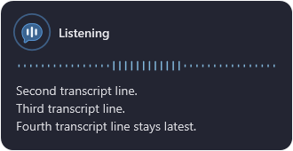
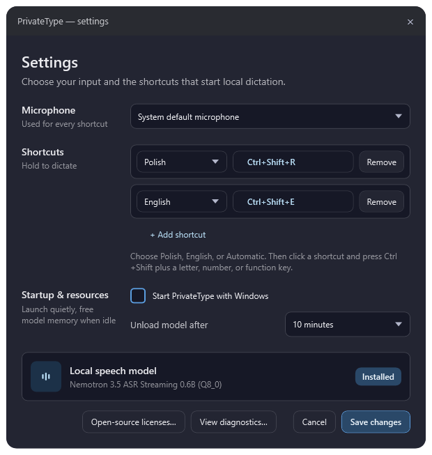

# PrivateType

**PrivateType is a local, hold-to-dictate speech-input app for Windows.** It
listens only while you hold a shortcut, shows what it is hearing, and inserts
the final text into the field that was active when dictation began.

Audio and recognition stay on the computer. There is no account, cloud
recognition fallback, or retained transcript history.



## Download and start

1. Download `PrivateType-win-x64.zip` and its `.sha256` checksum from
   [Releases](https://github.com/kkolodziejczak/privatetype/releases).
2. Verify the checksum, then unpack the ZIP into a writable folder. Do not run
   it from `Program Files`, a read-only archive, or a protected network path.
3. Start `PrivateType.exe`.
4. On the first launch, approve the separate local-model download and wait for
   its verification to finish.
5. Open **Settings** from the tray icon or ready bubble, choose a microphone,
   and confirm your shortcuts.

The first public releases use a direct, unsigned ZIP with manual updates. Use
the SHA-256 file published beside each release and download only from this
repository's Releases page.

```powershell
Get-FileHash .\PrivateType-win-x64.zip -Algorithm SHA256
```

The reported hash must exactly match `PrivateType-win-x64.zip.sha256`.

## Use it

| Language | Default shortcut |
| --- | --- |
| Polish | `Ctrl+Shift+R` |
| English | `Ctrl+Shift+E` |

Hold a shortcut while speaking, then release it to insert the final text. The
model loads when PrivateType starts. If it has been unloaded after the selected
idle timeout, keep holding the shortcut while **Loading local model…** is
shown; it will move to **Listening** when ready.



### What the app does

- When dictation starts, the bubble moves to the monitor under the mouse while
  keeping the same relative screen position.
- The ready bubble is faded while the model is unloaded and fully opaque once
  the model is loaded.
- A 44-band voice spectrum and icon react to microphone input; visual gain
  adapts to quieter speech without changing the audio passed to recognition.
- The live transcript keeps three visible lines and follows the newest text.
- **Start PrivateType with Windows** creates a current-user Startup entry.
- **Unload model after** frees model memory after 5, 10, 15, or 30 idle
  minutes.
- Diagnostics retain only safe warnings and errors in memory until the app
  closes. They never include audio or dictated text.

## Requirements

PrivateType is a CPU-only `win-x64` app.

| Resource | Minimum practical guidance | Recommended |
| --- | --- | --- |
| Operating system | Windows 10 or 11, 64-bit | Current Windows 11 build |
| CPU | 64-bit x86 CPU | Modern multi-core CPU |
| RAM | 4 GB total, at least 2 GB free while dictating | 8 GB total or more |
| Free disk space | 1.2 GB for app, runtime, model, and working room | 2 GB or more |
| Microphone | Any Windows recording device | Headset or close microphone in a quiet room |

The pinned Nemotron Q8_0 model is about 707 MiB. The self-contained app/runtime
folder is about 190 MB before the model download. The current native runtime
requires the [Microsoft Visual C++ x64 Redistributable](https://learn.microsoft.com/en-us/cpp/windows/latest-supported-vc-redist)
if it is not already installed.

## Privacy, limits, and troubleshooting

- PrivateType does not retain raw audio or inserted transcripts.
- `data/settings.json` stores only the selected microphone, shortcuts, bubble
  location, Windows-startup preference, and model idle timeout.
- The model is downloaded separately from NVIDIA; it is not included in the
  app ZIP. See [MODEL_ARTIFACT.md](MODEL_ARTIFACT.md) for its source and
  checksum.
- Normal desktop text fields are supported. Password/secure fields, elevated
  apps, remote desktops, games, and apps that reject synthetic input are not.
  If the foreground app changes while dictating, insertion is cancelled.

| Symptom | What to do |
| --- | --- |
| First dictation pauses at loading | Keep holding the shortcut until the local model is ready. |
| Text was not inserted | Check the original target is a normal, non-elevated text field, then open **Settings → View diagnostics…**. |
| Bubble is on another monitor | Drag the ready bubble where you want it on that monitor. |
| Recognition is weak | Select the right microphone and speak close to it. The spectrum is not an audio-gain control. |
| Engine will not start | Install the current Microsoft Visual C++ x64 Redistributable, then relaunch the app. |

## Licenses

PrivateType's own source and maintainer-owned assets are available under the
[MIT License](LICENSE). The portable release includes a `licenses` folder and
`THIRD-PARTY-NOTICES.txt` for NeMo-Speech.cpp, ggml, cpp-httplib,
SentencePiece, Protobuf, Abseil, utf8-range, NAudio, and the self-contained
.NET runtime. Open the same notices from **Settings → Open-source licenses…**.

## Report a problem or contribute

Please use [GitHub Issues](https://github.com/kkolodziejczak/privatetype/issues)
for reproducible bugs and feature ideas. Do not include dictated text, raw
audio, settings files, or diagnostic reports without first reviewing them.

Read [CONTRIBUTING.md](CONTRIBUTING.md) before submitting a change and
[SECURITY.md](SECURITY.md) for vulnerability reporting. The future technical
roadmap is in [TODO.md](TODO.md).

## Build from source

For contributors with the local engine runtime available:

```powershell
dotnet test .\tests\PrivateType.Core.Tests\PrivateType.Core.Tests.csproj
dotnet test .\tests\PrivateType.App.Tests\PrivateType.App.Tests.csproj
dotnet run --project .\tests\PrivateType.App.LayoutProbe\PrivateType.App.LayoutProbe.csproj
```

Create and verify a portable release with:

```powershell
powershell -NoProfile -ExecutionPolicy Bypass -File .\Build-PortableRelease.ps1
powershell -NoProfile -ExecutionPolicy Bypass -File .\Test-PortableRelease.ps1
```

Agents working in this repository should follow [AGENTS.md](AGENTS.md).
