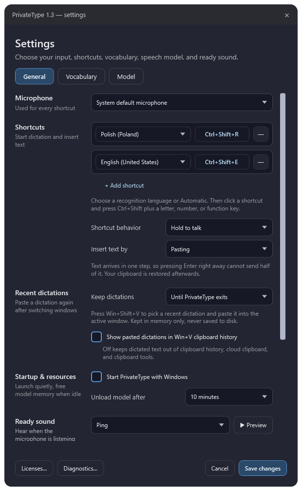

# PrivateType

**PrivateType is local, hold-to-dictate speech input for Windows.** Hold a
shortcut, speak, and release: the text is typed into the window you were
using.

Everything runs on your computer. There is no account, no cloud, and no saved
transcript history.


## Get started

1. Download `PrivateType-<version>-win-x64.zip` from
   [Releases](https://github.com/kkolodziejczak/privatetype/releases).
2. Unpack it into a folder you can write to (not `Program Files`).
3. Start `PrivateType.exe`.
4. Choose a speech model and approve its download (about 700 MiB, once).
5. Open **Settings** from the tray icon and pick your microphone.

To update, close PrivateType, unpack the new ZIP, and start the new
`PrivateType.exe`.

<details>
<summary>Verify the download (optional)</summary>

Each release has a `.zip.sha256` file next to the ZIP. The hash must match
exactly:

```powershell
Get-FileHash .\PrivateType-1.3.0-win-x64.zip -Algorithm SHA256
```

Releases are unsigned, so download them only from this repository.
</details>

## Use it

| Shortcut | What it does |
| --- | --- |
| `Ctrl+Shift+R` | Dictate in Polish |
| `Ctrl+Shift+E` | Dictate in English |
| `Win+Shift+V` | Paste a recent dictation, including one that wasn't inserted |

You can change every shortcut in **Settings**.

Hold a dictation shortcut while you speak, then release it to insert the text.
A short ping means PrivateType is listening. In **Settings → Shortcuts** you
can:

- add more shortcuts, each with one of 32 languages or Automatic,
- switch to **Press to start and stop** if you'd rather not hold the keys,
- insert text by **Typing characters** instead of pasting, for apps like Vim
  or PuTTY where Ctrl+V doesn't work.

When pasting, your clipboard is put back afterwards.

**Text not inserted?** If you switch windows before the text arrives, or the
app doesn't accept typing, the bubble says the text wasn't inserted. Nothing is
lost: press **Win+Shift+V**, and the dictation is in the list (newest first),
marked **Not inserted**. Press Enter to paste it into the window you're in now.
Dictations are kept in memory only, until PrivateType exits by default.

All shortcuts, including the keys inside PrivateType's windows, are listed in
the [settings guide](docs/SETTINGS.md#keyboard-shortcuts).



Every setting, with its default and when to change it, is explained in the
[settings guide](docs/SETTINGS.md).

### Speech models

Pick a model on first launch; Parakeet is recommended. You can download the
other one, switch, or delete one later in **Settings → Model**.

| | Parakeet TDT v3 (recommended) | Nemotron 3.5 Streaming |
| --- | --- | --- |
| While you speak | Preview about once a second | Words appear live |
| Language | Detected automatically (25 European languages) | From the shortcut (32 languages) |
| Vocabulary boosting | No | Yes |
| Download | About 681 MiB | About 708 MiB |

Choose Nemotron for live words while you speak, vocabulary boosting, or Asian
languages.

### Vocabulary

If PrivateType keeps getting a name or term wrong, teach it the right spelling.
Choose **Teach from last dictation…** in the bubble menu, click the words it
got wrong, and type the correct spelling. From then on it recognizes the term
and fixes those wrong words.


You can also add phrases yourself in **Settings → Vocabulary**, for one
language or for all of them. You can import and export phrase lists as packs.

## Requirements

- Windows 10 or 11, 64-bit, with an x86-64 CPU. No GPU is needed.
- 8 GB RAM recommended. The loaded model uses about 0.8–1.1 GiB.
- About 1.2 GB of free disk space for the app, one model, and working room.
- The [Microsoft Visual C++ x64 Redistributable](https://learn.microsoft.com/en-us/cpp/windows/latest-supported-vc-redist),
  if it isn't already installed.

## Privacy

- Audio is never saved. Recognition runs locally.
- Recent dictations stay in memory only and are cleared when PrivateType exits.
  In Settings you can keep them for less time, or not at all.
- Settings and your vocabulary are stored in `app/data/settings.json` in the
  release folder.
- Models are downloaded from NVIDIA's public releases. See
  [MODEL_ARTIFACT.md](MODEL_ARTIFACT.md) for their sources and checksums.

## Troubleshooting

| Problem | What to do |
| --- | --- |
| First dictation shows **Loading local model…** | Keep holding the shortcut until it is ready. |
| Text was not inserted | Password fields, apps running as administrator, remote desktops, and games are not supported. Paste the text from **Win+Shift+V** instead. |
| Recognition is weak | Choose the right microphone in Settings and speak close to it. Add tricky words to Vocabulary. |
| App won't start the speech engine | Install the Microsoft Visual C++ x64 Redistributable and start PrivateType again. |

Still stuck? Open **Settings → Diagnostics…** and
[open an issue](https://github.com/kkolodziejczak/privatetype/issues). Please
don't include dictated text, audio, or settings files.

## License

PrivateType is [MIT licensed](LICENSE). Third-party notices are in
`app/licenses` and in **Settings → Licenses…**.

## Contributing

See [CONTRIBUTING.md](CONTRIBUTING.md), [SECURITY.md](SECURITY.md), and the
roadmap in [TODO.md](TODO.md). Agents should follow [AGENTS.md](AGENTS.md).

```powershell
dotnet test .\tests\PrivateType.Core.Tests\PrivateType.Core.Tests.csproj
dotnet test .\tests\PrivateType.App.Tests\PrivateType.App.Tests.csproj
dotnet run --project .\tests\PrivateType.App.LayoutProbe\PrivateType.App.LayoutProbe.csproj
powershell -NoProfile -ExecutionPolicy Bypass -File .\Build-PortableRelease.ps1
powershell -NoProfile -ExecutionPolicy Bypass -File .\Test-PortableRelease.ps1
```

Screenshots in `docs/images` come from the layout probe (output in
`%TEMP%\live-dictation-layout-probe`): `status-panel-recording.png`,
`teach-one-fix.png` (as `teach-vocabulary.png`), and everything in its `docs`
folder. Pass `-p:Version=<release>` so the window title shows the release
version.
