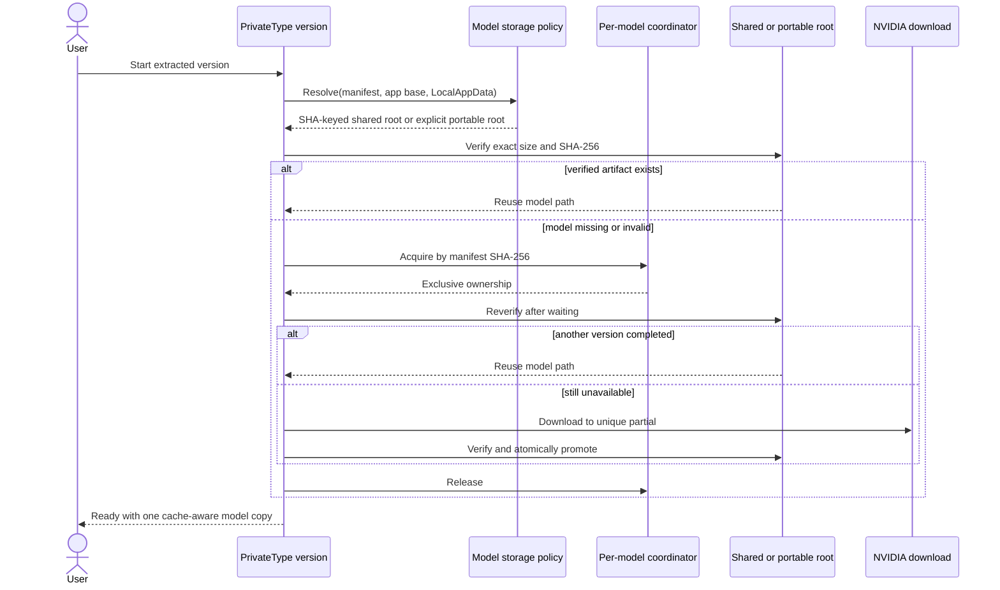

# Shared Model Cache Implementation Plan

## Purpose

Store the pinned speech model once per Windows user so every cache-aware PrivateType version can reuse the same verified 741,548,352-byte artifact instead of downloading another copy into each extracted release folder. Preserve an explicit portable-local mode for users who want the model to move with one release folder.

## Agreed Decisions

- The default model root is `%LOCALAPPDATA%\PrivateType\models\<lowercase-sha256>\`.
- The model identity is its pinned byte length and full SHA-256, not the app version or filename alone.
- A deliberately present `app\models\` directory selects portable-local mode; otherwise the app uses the shared cache.
- Shared and portable downloads retain the existing unique partial-file, size/hash verification, and same-directory atomic promotion behavior.
- Concurrent cache-aware versions coordinate by model identity so only one writer downloads or promotes the artifact; waiters reuse the verified result and honor cancellation.
- v1.0.2 cannot read the new cache. Its existing local model remains untouched and may coexist until that old release folder is removed. Cache-aware versions reuse one shared artifact thereafter.
- No automatic scanning, moving, hard-linking, or deletion of models from other release folders. This avoids silently breaking rollback, crossing volumes, or modifying an older installation.
- The cache contains only public model artifacts and synchronization files—never settings, microphone data, audio, transcripts, or diagnostics.

## Current State

- `PortablePaths.ModelsDirectory` currently resolves to `app\models` beside the executable and `EnsureWritable` always creates it.
- `ModelProvisioner` already downloads to a unique `.partial`, validates exact bytes and SHA-256, atomically promotes the file, and cleans cancellation/failure partials.
- Every versioned portable folder therefore owns a separate verified model copy.
- The release ZIP excludes `app\models`; documentation currently promises that moving the complete post-download folder retains model and settings.

## Intent Model

| Actor | Input | Action | Output / state | Failure behavior |
| --- | --- | --- | --- | --- |
| Path policy | executable directory, LocalAppData, manifest | Select portable root when `app\models` deliberately exists; otherwise select SHA-keyed shared root | One canonical model root | Reject unusable/empty OS cache path; do not silently fall back to another storage mode after a write failure |
| Provisioner | canonical root, manifest, downloader | Verify existing model or coordinate one download | Verified immutable model path | Cancel cleanly; reject corrupt bytes; leave no active corrupt artifact |
| Concurrent version | same manifest identity | Wait for current writer, then reverify | Reused artifact without a second download | Cancellation stops only the waiter; abandoned ownership permits recovery |
| User | extracted release | Accept model terms and download | Copy explains shared default or portable-local mode truthfully | Existing v1.0.2 local copy is not moved or deleted |

## Common Ground Diagram

## Target Contracts

- Keep `ModelProvisioner` storage-root agnostic. Add focused Core ownership for exact artifact verification and bounded cross-process coordination rather than embedding Windows path policy into it.
- Add an App path policy that returns a small result describing `Shared` or `Portable` mode plus its canonical directory.
- Shared directory: `%LOCALAPPDATA%\PrivateType\models\<manifest.Sha256.ToLowerInvariant()>`.
- Portable directory: `<AppContext.BaseDirectory>\models`, selected only when that directory already exists before path initialization.
- Do not create `app\models` merely to probe writability. Portable settings remain in `app\data` as today.
- Cache synchronization names must contain no user content and must be scoped by the full model hash.
- Model setup and README copy must state that the default model is shared across cache-aware PrivateType versions on the current Windows account; document how to opt into portable-local mode before first launch.

## Stage 1: Shared verified model storage

**Goal:** Deliver the complete default shared-cache flow, explicit portable-local override, concurrency safety, truthful documentation/UI, and release verification as one end-to-end slice.

**Allowed files/modules:** focused storage/path types under `src/PrivateType.Core` and `src/PrivateType.App`; `ModelProvisioner`; `ModelArtifactVerifier`; `ModelCacheCoordinator`; `PortablePaths`; the dedicated App model-storage policy; application composition; Model Setup copy; corresponding dedicated Core/App tests; `PrivateType.App.LayoutProbe`; `README.md`; `PORTABLE_RELEASE.md`; portable build/test scripts only where assertions must change; this plan.

**Do not change:** pinned model URL/hash/size/license, recognition engine/runtime, settings location/schema, transcript/audio retention, startup ownership rules, release ZIP exclusion of the model, or old release folders.

**Required sequence:**

1. Reconcile the Risk Manifest against current paths, test seams, Windows filesystem behavior, and file sizes. Stop on any conflicting canonical owner or unsafe fallback requirement.
2. Add failing Core/App tests for shared-path identity, explicit portable selection, absent/empty LocalAppData, exact artifact reuse, corrupt artifact replacement, waiter cancellation, one-download concurrency, abandoned-owner recovery, and no mutation of old/local candidates.
3. Extract one exact size/SHA verifier if needed so path selection, provisioner, and concurrency rechecks do not duplicate artifact rules.
4. Implement the storage-mode/path policy. Stop creating `app\models` by default; retain the existing writable `app\data` contract.
5. Add bounded cross-process coordination keyed by the full SHA-256. Reverify after acquiring ownership, clean only owned/stale matching partial state, and preserve atomic promotion.
6. Wire `DictationApplication` to construct `ModelProvisioner` with the selected root and expose storage mode only through non-sensitive UI copy/status as needed.
7. Update Model Setup wording and documentation for shared default, portable opt-in, v1.0.2 coexistence, rollback behavior, and manual cleanup. Do not claim automatic migration or deduplication of old copies.
8. Extend LayoutProbe assertions/renders for affected copy and run `$verify-ui-quality`.
9. Run Core/App tests, full interactive LayoutProbe, `git diff --check`, portable release verification, and a two-process/manual acceptance proving a second cache-aware copy reuses the artifact offline.

### Structural preflight reconciliation (2026-08-18)

The thermo-nuclear structural preflight returned **Revise shape**. No file-size emergency was found; the required revision is ownership-focused and is incorporated below:

- `src/PrivateType.App/ModelStoragePolicy.cs` is the canonical owner of shared-versus-portable root resolution. Resolve it before any directory creation; `DictationApplication` consumes the immutable result and does not implement path policy.
- `PortablePaths` remains data-only: it creates/probes `app\\data` and never creates `app\\models` unless that directory was deliberately present before resolution.
- `src/PrivateType.Core/ModelArtifactVerifier.cs` owns exact byte-length and SHA-256 verification. `ModelProvisioner` and coordination rechecks call it rather than duplicating the rule.
- `src/PrivateType.Core/ModelCacheCoordinator.cs` owns full-hash-scoped cross-process lock lifecycle, bounded waiting, independent cancellation, and abandoned-owner recovery. `ModelProvisioner` owns only download, verification, and same-directory atomic promotion under the coordinator.
- Cache-focused cases go in dedicated `ModelCacheTests.cs` and `ModelStoragePolicyTests.cs`; existing settings and Windows-boundary scenario files remain focused.
- Guardrails: no path-policy fallback after a write failure; no old-release discovery/migration/link/delete; no private data in cache names or files; no model/runtime/settings-schema changes; no model in release output. The stage is clear to implement only with these boundaries.

### Risk Manifest

#### Risks and Owners

| ID | Risk | Canonical owner | Consumers |
| --- | --- | --- | --- |
| R1 | Storage mode or path drift creates duplicate models or breaks portability | App model storage policy | `DictationApplication`, docs, release tests |
| R2 | Concurrent versions download/promote twice or expose corrupt state | Core model coordinator + `ModelProvisioner` | Every cache-aware app process |
| R3 | Migration or cleanup breaks v1.0.2 rollback | Storage policy and documented non-migration boundary | Users retaining old extracted versions |
| R4 | Shared storage accidentally gains private application data | `PortablePaths` ownership split | Settings store, model cache, diagnostics |

#### States and Variants

| ID | States or variants | Required paths | Failure edges |
| --- | --- | --- | --- |
| R1 | shared default; explicit portable directory; unusable LocalAppData | exact deterministic selection before provisioning | clear startup/setup failure; no silent mode switch |
| R2 | verified; missing; corrupt; writer active; waiter cancelled; owner abandoned; completed | reverify before and after ownership; one atomic promotion | no corrupt active model; cancellation does not cancel another process |
| R3 | old local copy retained; shared copy created; old folder deleted manually | never scan/move/delete other release models | old binary may redownload if its own copy is removed |
| R4 | portable `data`; shared/portable `models`; temporary lock/partial names | settings remain executable-local; cache is artifact-only | errors/logs contain paths/status, never private payloads |

#### Persistence

| ID | Invariant | Enforcement | Transaction boundary | Concurrency |
| --- | --- | --- | --- | --- |
| R1 | one selected root remains authoritative for the process | immutable policy result | application initialization | selection occurs before any directory creation |
| R2 | active file always matches exact manifest | size/SHA verifier + same-directory move | unique partial to final model path | cross-process ownership keyed by full SHA; reverify after wait |
| R3 | no old installation is mutated | no discovery/migration writer | none | none |
| R4 | only model/synchronization artifacts enter shared root | narrow cache API and tests | per-model cache directory | synchronization metadata contains no private data |

#### Proof

| ID | Public seam | Planned red test | Expected observation | Final evidence |
| --- | --- | --- | --- | --- |
| R1 | storage policy resolution | missing/present portable directory plus controlled LocalAppData | exact mode and SHA-keyed path; no default `app\models` creation | App policy matrix passes; fresh-path test confirms no `app\models` or LocalAppData creation |
| R2 | `EnsureAvailableAsync` with two provisioners/process-capable coordinator | concurrent calls, cancellation, corrupt bytes, abandoned owner | one download/promotion; waiters reuse or cancel independently; retry recovers | Core cache suite passes; concurrent LayoutProbe workers produced one synthetic download/promotion, then an offline worker reused the artifact without increasing the download marker |
| R3 | initialized new-version path with synthetic old-version candidate | place verified model only in unrelated old folder | old file remains byte-for-byte and path is not selected/mutated | Core cache test proves unrelated old-release bytes remain unchanged and are not selected |
| R4 | complete startup/path initialization | synthetic settings/data plus cache inventory | settings remain local; shared inventory contains only allowed names | App policy/data-only tests and cache naming inspection pass; no settings/audio/transcript/diagnostic writer enters the cache API |

#### Budget and Environment

| ID | File, module, provider, or tool | Current fact | Planned limit or required proof | Final fact |
| --- | --- | --- | --- | --- |
| R1 | current model | 741,548,352 bytes; SHA-256 `a5c435f294eea8f88ce68dd27b8c3bfea7f777cb2fbba04fcd30eaa555f429ae` | exact manifest identity preserved | Pinned manifest unchanged in `PinnedModel`; path key uses the full lowercase SHA-256 |
| R2 | Windows coordination/filesystem | multiple extracted versions may run under one user | prove bounded wait, cancellation, abandoned-owner recovery, same-directory atomic promotion | Core suite passes cancellation/abandonment/corrupt/atomic cases; two-process race and offline reuse pass; coordinator wait is bounded to five minutes by default |
| R4 | portable release | ZIP excludes `app\models`; settings are in `app\data` | exclusion remains; shared cache is never copied into release output | Existing 1.0.2 archive smoke passes clean unpack, no bundled model, and relocation; settings path remains `app\\data` |

**Tests/proof:** Core storage policy/verifier/provisioner concurrency tests; App path/composition/copy tests; full interactive LayoutProbe and `$verify-ui-quality`; portable builder/smoke verification; exact model manifest assertions; controlled two-process offline reuse acceptance; repository and cache inventory checks containing no private data.

**Stop conditions:** LocalAppData cannot be resolved safely; portable mode cannot be selected before directory creation; coordination cannot guarantee independent waiter cancellation and abandoned-owner recovery; any implementation scans/moves/deletes an old release model; model/runtime pins change; release output contains a model; UI verification is FAIL/BLOCKED; exact shared reuse cannot be proven offline.

**Implementation prompt:** Implement Stage 1 only. Reconcile the Risk Manifest, write the storage-selection and concurrency tests red first, preserve exact model verification and portable settings, implement the smallest shared-cache slice, update truthful UI/docs, run all code/UI/portable/two-process gates, and stop on any stop condition.

Stage 1 acceptance:

- [x] A fresh extracted release without `app\models` downloads or reuses the exact pinned model under the SHA-keyed per-user cache.
- [x] A release with a deliberately pre-created `app\models` directory remains self-contained and never reads/writes the shared cache.
- [x] Two cache-aware versions racing for the same missing model perform one verified download/promotion; cancellation and abandoned-owner recovery are proven.
- [x] Starting a second cache-aware version offline reuses the verified shared model without download.
- [x] Existing v1.0.2/other release model files are not discovered, moved, linked, overwritten, or deleted.
- [x] Settings remain in portable `app\data`; no private data enters the shared cache.
- [x] The release ZIP still excludes the model and shared cache.
- [x] Model Setup, README, and portable-release documentation describe shared default, portable opt-in, coexistence, rollback, and cleanup accurately.
- [x] Core/App tests pass; full interactive LayoutProbe and `$verify-ui-quality` pass; portable and path/inventory verification pass.

### Stage 1 gate record (2026-08-18)

- Structural preflight: **Revise shape**, then reconciled and clear to implement. Guardrails are the dedicated App policy, data-only `PortablePaths`, Core verifier/coordinator ownership, bounded full-hash lock, and no old-release/private-data mutation.
- Plan-compliance review: round 1 found F1 (post-lease cancellation) and F2 (missing recorded two-process/offline evidence); both were repaired. Fresh round 2: **no crucial findings remain**.
- Thermo-nuclear quality review: round 1 **no crucial findings**. Residual non-crucial note: unusual non-local filesystem backends were not separately exercised; the supported contract is Windows local filesystem storage.
- UI-quality gate: **PASS**. Shared and portable consent/progress states rendered with synthetic copy; hyperlink keyboard focus, geometry, existing monitor/taskbar states, and clean-production sweep passed.
- Verification: Core 40/40, App 71/71, full LayoutProbe pass after final repairs, `git diff --check` pass, portable 1.0.2 smoke pass, and two-process race/offline reuse pass with exactly one synthetic download marker and one verified artifact.
- Claude Code review: an initial Claude Opus 5/high pass returned 19 broad findings. Confirmed verifier, coordinator, setup-order, documentation, and boundary-test defects were repaired; plan-conflicting legacy cleanup/fallback/automatic-GC suggestions were explicitly triaged. A focused repair pass returned nine findings, including one high-severity unreadable-artifact deletion risk; every finding was addressed by distinguishing missing/invalid artifacts from unreadable ones, preserving original failure results during partial cleanup, retaining a read-only lock sentinel, correcting the first visible setup state, and strengthening regression assertions. Final repair proof is Core 49/49, App 72/72, full LayoutProbe/UI-quality pass, and repeated two-process/offline reuse.

## Test Strategy

- **Core:** deterministic path-free verifier/provisioner/coordinator tests using synthetic bytes and temporary directories; no real model contents.
- **App:** controlled base-directory/LocalAppData policy inputs, composition wiring, user-facing copy, and privacy boundaries.
- **UI:** all Model Setup states rendered with the new storage explanation; keyboard/focus and existing layout assertions retained.
- **Full system:** two isolated cache-aware app/probe processes share a temporary synthetic cache; one completes provisioning and the other reuses it offline.
- **Release:** build/smoke scripts continue proving no model or cache is shipped.

## Flow Traceability

| Flow | Planned owner | Proof |
| --- | --- | --- |
| Select shared versus portable root | App model storage policy | path-policy matrix |
| Verify existing artifact | Core verifier | exact size/hash cases |
| Coordinate download | Core coordinator + provisioner | concurrent/cancel/abandon matrix |
| Promote artifact | `ModelProvisioner` | corrupt/partial/atomic tests |
| Wire startup | `DictationApplication` | App composition tests |
| Explain storage | Model Setup + docs | LayoutProbe and documentation review |
| Preserve packaging | portable scripts | release-content assertions |

## Explicit Non-Goals

- Retrofitting v1.0.2 binaries to read the cache.
- Searching arbitrary directories for prior models.
- Automatically moving, hard-linking, deleting, or deduplicating old release models.
- Sharing settings, vocabulary, diagnostics, audio, or transcripts.
- Automatic application updates or model garbage collection.
- Changing the pinned model, engine, model license, or release signing strategy.

## Definition of Done

The feature is complete when the single stage and every acceptance item are checked with recorded final Risk Manifest evidence, mandatory implementation/code-quality gates pass on the same diff, Claude Code reports no untriaged crucial finding, the implementation is committed, and a clean cache-aware second-copy offline reuse has been demonstrated without modifying any old release model.
