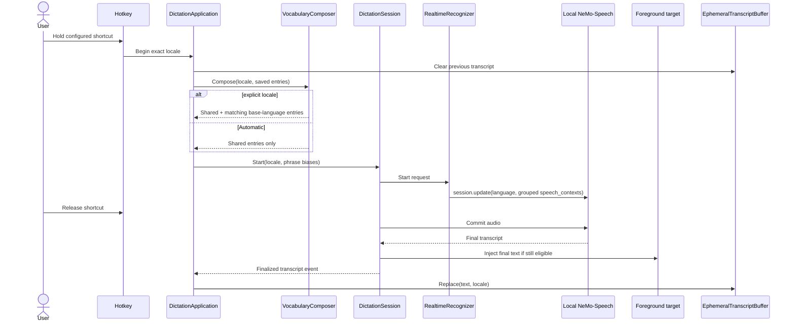
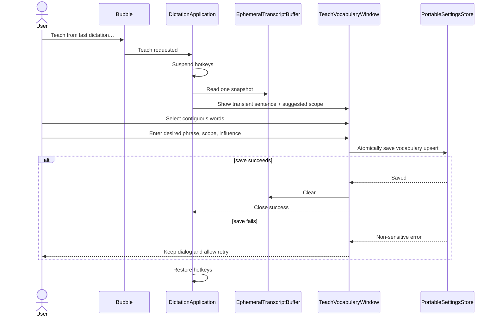
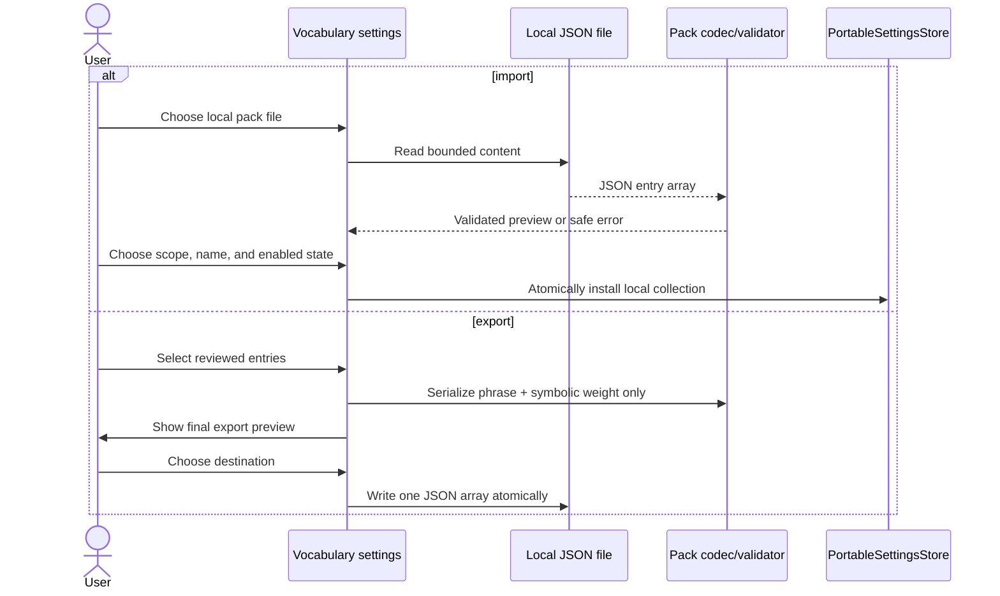

# Vocabulary and Expanded Languages Implementation Plan

## Purpose

Add a private, user-owned vocabulary that biases the pinned local Nemotron recognizer toward desired words and phrases, expand explicit recognition from Polish/English to every locale the pinned model can transcribe without fine-tuning, support simple offline vocabulary-pack sharing, and provide an optional quick-teach workflow for the immediately preceding dictation.

The feature must preserve PrivateType's defining behavior: hold-to-dictate, local processing, no cloud fallback, no retained transcript history, no transcript rewriting, and no model load unless recognition proof specifically requires it.

## Agreed decisions

- [x] Maintain one personal vocabulary plus separately named, enableable installed packs; do not turn personal vocabulary into named profiles.
- [x] Vocabulary has `Shared` and base-language scopes.
- [x] A base-language scope applies to every regional locale for that language.
- [x] Explicit recognition uses Shared plus the selected locale's base-language vocabulary.
- [x] Automatic recognition uses Shared vocabulary only.
- [x] Expose Automatic plus the model's 32 out-of-box locales; hide the eight adaptation-only locales.
- [x] A vocabulary entry stores only the desired spelling or phrase, never a misheard-to-corrected replacement pair.
- [x] Each entry has user-selected `Low`, `Normal`, or `Strong` influence; new entries default to Normal.
- [x] Vocabulary is editable in Settings and reachable directly from the bubble menu.
- [x] `Teach from last dictation…` is an on-demand bubble action, not an automatic post-dictation interruption.
- [x] The teach view displays the one ephemeral sentence as selectable word chips and supports one word or a contiguous range.
- [x] The teach dialog preselects the dictation's base language, or Shared after Automatic, while allowing the user to change the scope.
- [x] Teaching changes future recognition only; it never rewrites or copies over already injected text.
- [x] The last transcript exists only in memory until the next dictation begins, the teach dialog is saved/dismissed, or the app exits.
- [x] Personal vocabulary and quick teach persist only the desired entry, its scope, and influence; never persist the misheard wording.
- [x] Import and export packs manually; PrivateType never downloads, discovers, or synchronizes packs.
- [x] A share file is a top-level JSON array of `{ "phrase", "weight" }` entries. `weight` is optional and defaults to `normal`.
- [x] Share files contain no pack ID, version, author, attribution, license, provenance, locale, or update metadata.
- [x] The filename supplies the proposed pack name; the user chooses one Shared/base-language scope during import.
- [x] Imported packs are separately enabled, disabled, edited, exported, renamed, and removed. Editing changes only the installed local copy.
- [x] Export from personal vocabulary includes only entries explicitly selected by the user from the currently visible scope and shows a final preview.
- [x] Personal vocabulary wins over an identical phrase from packs; otherwise the strongest enabled-pack influence wins.
- [x] Curated example pack files may live in a dedicated repository directory with CI validation, but they are downloads only and are not bundled into releases.
- [x] Preserve Polish and English default shortcuts and migrate existing settings without loss.
- [x] Keep the application UI in English; UI localization is separate work.
- [x] Prove and calibrate word boosting before building the production UI.

## External capability facts

The implementation is pinned to the repository's current artifacts:

- Model: `nvidia/nemotron-3.5-asr-streaming-0.6b`, revision and checksum in [MODEL_ARTIFACT.md](MODEL_ARTIFACT.md).
- Runtime: NeMo-Speech.cpp commit `1118951337094db3b362fbf1b27e871696f10590`, recorded in [ENGINE_DECISION.md](ENGINE_DECISION.md).
- The pinned realtime protocol accepts `speech_contexts: [{ phrases: [...], boost: N }]` and a `prompt` compatibility field. Use `speech_contexts`; do not use `prompt` for this feature. See NVIDIA's [pinned HTTP API reference](https://github.com/NVIDIA/NeMo-Speech.cpp/blob/1118951337094db3b362fbf1b27e871696f10590/docs/api.md#websocket-v1realtime).
- NVIDIA documents 19 transcription-ready and 13 broad-coverage locales that transcribe out of the box, plus eight adaptation-only locales that require fine-tuning. See the [model language table](https://huggingface.co/nvidia/nemotron-3.5-asr-streaming-0.6b#supported-languages).
- NVIDIA does not document a universally safe boost range for this exact local runtime/model pair. Stage 1 is therefore a required calibration spike, not optional research.

## Current state

| Concern | Current owner | Current behavior / constraint |
|---|---|---|
| Recognition language | [DictationContracts.cs](src/PrivateType.Core/DictationContracts.cs) | Closed `RecognitionLanguage` enum with Polish, English, and Auto. |
| Shortcut persistence | [PortableSettings.cs](src/PrivateType.Core/PortableSettings.cs) | `ShortcutBinding` serializes the enum numerically; validation rejects all other values. |
| Language UI | [SettingsWindow.xaml.cs](src/PrivateType.App/SettingsWindow.xaml.cs) | Hard-coded list of three choices. |
| Runtime mapping | [RealtimeRecognizer.cs](src/PrivateType.App/RealtimeRecognizer.cs) | Hard-coded enum-to-`pl-PL`/`en-US`/`auto`; sends sample rate, language, and punctuation only. |
| Session lifecycle | [DictationSession.cs](src/PrivateType.Core/DictationSession.cs) | Final text is taken once, injected, and discarded; there is no completion event carrying the final transcript. |
| Composition root | [DictationApplication.cs](src/PrivateType.App/DictationApplication.cs) | Creates sessions, owns Settings and bubble events, and suspends hotkeys around modal Settings. |
| Bubble actions | [DictationBubble.xaml](src/PrivateType.App/DictationBubble.xaml) | Settings and Quit only. |
| Settings layout | [SettingsWindow.xaml](src/PrivateType.App/SettingsWindow.xaml) | Fixed-width, auto-height, single-page form; unsuitable for an unbounded vocabulary list. |
| Vocabulary sharing | None | No pack parser, installed-pack state, file picker flow, export writer, repository directory, or validation command exists. |
| Privacy statement | [README.md](README.md) | No retained transcript history; settings currently described as containing no vocabulary. |
| UI proof | [PrivateType.App.LayoutProbe](tests/PrivateType.App.LayoutProbe) | Renders current setup, bubble, and Settings states; must be extended for every new state. |

The repository is clean at planning time. This plan and [the annotated UI mock](docs/VOCABULARY_UI_MOCK.md) are the only planning changes.

## Intent model

### Actors

- **Dictating user:** selects an exact recognition locale through a shortcut and optionally maintains vocabulary.
- **Settings editor:** validates and atomically persists shortcuts and vocabulary.
- **Vocabulary composer:** chooses the entries applicable to one recognition request and resolves duplicates.
- **Vocabulary-pack importer/exporter:** previews and validates bounded local JSON arrays without network access.
- **Realtime recognizer:** serializes calibrated phrase groups into the pinned WebSocket protocol.
- **Dictation session:** recognizes, injects, and announces one finalized transcript without retaining history.
- **Ephemeral transcript buffer:** owns the single last teachable transcript and its destruction rules.
- **Teach dialog:** converts a selected word range into a desired vocabulary entry; it never edits the target application.

### Inputs

- Exact locale code selected by a shortcut, such as `pl-PL`, `en-US`, `es-ES`, or `auto`.
- Locally stored personal and enabled-pack entries: desired phrase, `shared` or base-language scope, and influence.
- A manually selected local `.privatetype-vocabulary.json` file containing only a bounded entry array.
- PCM16 microphone audio for the active held shortcut.
- One finalized transcript held temporarily for quick teaching.

### Outputs

- A realtime `session.update` containing the exact locale and zero to three calibrated `speech_contexts` groups.
- Final text injected into the originally captured eligible target.
- Versioned local settings containing stable locale codes and vocabulary entries.
- Installed pack collections stored locally, plus explicitly exported JSON arrays containing only reviewed phrases and weights.
- An optional new vocabulary entry derived from a transient selection.

### State and ownership

| State | Canonical owner | Lifetime |
|---|---|---|
| Supported locale catalog | Core language catalog | Static for the pinned model/release. |
| Shortcut locale codes | Portable settings | Persistent, local, atomic save. |
| Vocabulary entries | Portable settings | Persistent, local, atomic save. |
| Installed pack name, scope, enabled state, and entries | Portable settings | Persistent, local, atomic save; no link to the source file. |
| Calibrated influence mapping | One recognizer configuration owner | Static for the pinned runtime/model; established by Stage 1. |
| Active recognition request | Dictation session / recognizer | One held shortcut. |
| Last teachable transcript | Ephemeral transcript buffer | At most one result; never serialized or logged. |
| Teach selection | Teach dialog view model | Dialog lifetime only. |

### Side effects

- Register or re-register configured global hotkeys.
- Start and communicate with the loopback-only local engine.
- Inject Unicode text into the captured foreground target.
- Atomically replace `data/settings.json` after successful validation.
- Read a user-selected local pack file and write an explicitly selected export destination.
- Display local modal Settings/Teach windows.

### Failure behavior

- Unknown locale or vocabulary scope: reject settings with a local validation message; never silently substitute Auto.
- Legacy settings migration failure: preserve the existing safe fallback and warning behavior; never partially rewrite the file.
- Invalid or oversized vocabulary: keep the editor open and do not truncate.
- Invalid/oversized pack import or duplicate installed name: show a content-free validation result and do not mutate settings; offer a unique local name rather than inferring an update.
- Pack export failure: leave settings unchanged and keep the reviewed selection available for retry.
- Engine rejection of `speech_contexts`: fail the calibration stage; do not ship a non-functional UI.
- Settings write failure from Teach: keep the dialog and ephemeral transcript for retry; do not update in-memory settings.
- Empty or failed dictation: no teachable result; Teach remains disabled.
- Next dictation: clear the previous transcript synchronously before any model loading or capture work.
- App shutdown: clear references to the ephemeral transcript; no persistence or diagnostics.

## Common ground diagrams

### Recognition sequence



### Quick-teach sequence



### Vocabulary-pack import/export sequence



## UI mock contract

Use [docs/VOCABULARY_UI_MOCK.md](docs/VOCABULARY_UI_MOCK.md) as the interaction template.

- Preserve its navigation, actions, privacy behavior, selection semantics, and enabled states.
- Reuse the current app theme and visual references rather than copying generic controls.
- Treat dimensions and sample content as illustrative.
- The implementation is not complete until every required mock state is rendered by `PrivateType.App.LayoutProbe`, visually inspected, and passed through `$verify-ui-quality` as required by [AGENTS.md](AGENTS.md).

## Target architecture

### 1. Static recognition locale catalog

Replace enum branching with one catalog entry per explicit locale plus Automatic:

```csharp
public sealed record RecognitionLocaleDefinition(
    string Code,
    string? BaseLanguageCode,
    string DisplayName,
    RecognitionSupportTier Tier);
```

Contract:

- `Code` is the exact engine value and persistent identity.
- `BaseLanguageCode` is null for `auto`; otherwise use a stable lowercase language code (`en`, `pl`, `es`).
- `DisplayName` is English UI text with region when multiple locales exist.
- `Tier` is `Automatic`, `TranscriptionReady`, or `BroadCoverage`.
- Catalog lookup, validation, sorting, base-language projection, and display labels have one canonical owner in `PrivateType.Core`.
- Do not derive the catalog remotely at runtime; PrivateType remains offline and the model artifact is pinned.

Required catalog:

| Tier | Locale codes |
|---|---|
| Automatic | `auto` |
| Transcription-ready | `en-US`, `en-GB`, `es-US`, `es-ES`, `fr-FR`, `fr-CA`, `it-IT`, `pt-BR`, `pt-PT`, `nl-NL`, `de-DE`, `tr-TR`, `ru-RU`, `ar-AR`, `hi-IN`, `ja-JP`, `ko-KR`, `vi-VN`, `uk-UA` |
| Broad coverage | `pl-PL`, `sv-SE`, `cs-CZ`, `nb-NO`, `da-DK`, `bg-BG`, `fi-FI`, `hr-HR`, `sk-SK`, `zh-CN`, `hu-HU`, `ro-RO`, `et-EE` |

The following adaptation-only locales are explicit non-options until the pinned model is replaced by a proven fine-tune: `el-GR`, `lt-LT`, `lv-LV`, `mt-MT`, `sl-SI`, `he-IL`, `th-TH`, `nn-NO`.

### 2. Versioned settings and migration

Change persisted shortcut identity from numeric enum values to exact locale-code strings and add vocabulary:

```csharp
public sealed record ShortcutBinding(string LocaleCode, int VirtualKey);

public enum VocabularyInfluence
{
    Low,
    Normal,
    Strong
}

public sealed record VocabularyEntry(
    string Phrase,
    string Scope,
    VocabularyInfluence Influence);

public sealed record InstalledVocabularyPack(
    string Name,
    string Scope,
    bool IsEnabled,
    IReadOnlyList<VocabularyPackEntry> Entries);

public sealed record VocabularyPackEntry(
    string Phrase,
    VocabularyInfluence Influence);
```

Persistence contract:

- Add an explicit schema version; the target schema is version 2.
- Serialize locale codes, scopes, and influence names as strings.
- `Scope` is `shared` or a base-language code present in the catalog.
- Legacy files without a schema version are parsed as schema 1. Map numeric `Language` values `0 -> pl-PL`, `1 -> en-US`, and `2 -> auto` while preserving microphone, shortcut keys, panel position, startup choice, and idle timeout.
- Perform migration in memory on load. Write version 2 only on the next successful normal save; do not mutate a readable legacy file merely by starting the app.
- Missing vocabulary and installed packs migrate to empty lists.
- Unknown legacy enum values and malformed files retain the current safe-default warning behavior.
- Keep the existing temporary-file plus replace transaction for all saves.
- Split catalog, settings domain/validation, and serialization/migration into focused files; do not turn `PortableSettings.cs` into a catch-all.

Illustrative version 2 JSON:

```json
{
  "SchemaVersion": 2,
  "MicrophoneId": "default",
  "Shortcuts": [
    { "LocaleCode": "pl-PL", "VirtualKey": 82 },
    { "LocaleCode": "en-US", "VirtualKey": 69 }
  ],
  "Vocabulary": [
    { "Phrase": "MVVM", "Scope": "shared", "Influence": "Normal" },
    { "Phrase": "dependency injection", "Scope": "en", "Influence": "Low" }
  ],
  "InstalledVocabularyPacks": [],
  "ModelIdleTimeoutMinutes": 10
}
```

The values are schema examples, not built-in vocabulary.

### 3. Vocabulary validation and composition

Create one domain service for normalization/validation and one pure composer for a recognition request.

Validation invariants:

- Normalize a phrase to Unicode NFC and trim outer whitespace before comparison/storage.
- Preserve internal whitespace, spelling, punctuation, and case.
- Reject blank text, CR/LF, other control characters, and phrases longer than 120 UTF-16 code units.
- Allow at most 200 entries and at most 16 KiB of normalized phrase UTF-8 payload across settings.
- Reject an exact ordinal duplicate of `(Scope, Phrase)` within persisted settings. Case variants remain distinct because decoder tokenization may be case-sensitive.
- Validate every scope and influence against the closed app catalogs.
- Never put a phrase in a validation exception, diagnostic event, or log message.

Composition invariants:

- Explicit locale: select Shared plus entries whose scope equals the catalog base language.
- Automatic: select Shared only.
- If the same exact phrase exists in Shared and the matching base-language scope, emit it once using the stronger influence.
- Group selected phrases by influence so the engine receives at most three `speech_contexts` objects.
- Stable ordering is influence then ordinal phrase; tests must not depend on user insertion order.
- Empty vocabulary omits `speech_contexts`, preserving the current request shape.
- Use `speech_contexts`; do not add post-recognition replacements and do not use the API's `prompt` field.

### 4. Recognition request contract

Replace `IStreamingRecognizer.StartAsync(RecognitionLanguage, ...)` with a request value that carries an exact locale and already composed phrase biases. `DictationSession` must not know persistence or vocabulary-selection rules.

Illustrative contract:

```csharp
public sealed record RecognitionPhraseGroup(
    VocabularyInfluence Influence,
    IReadOnlyList<string> Phrases);

public sealed record RecognitionRequest(
    string LocaleCode,
    IReadOnlyList<RecognitionPhraseGroup> PhraseGroups);
```

`RealtimeRecognizer` maps Low/Normal/Strong to the Stage 1 calibrated numeric values and serializes:

```json
{
  "type": "session.update",
  "session": {
    "sample_rate": 16000,
    "language": "pl-PL",
    "automatic_punctuation": true,
    "speech_contexts": [
      { "phrases": ["..."], "boost": 0.0 }
    ]
  }
}
```

The `0.0` is deliberately not a proposed production value. Stage 1 must replace the pending mapping with three proven positive values before Stage 3 proceeds.

### 5. Shareable vocabulary-pack contract

The share format is intentionally not a package manifest. It is a UTF-8 JSON array whose entries contain a desired phrase and an optional symbolic weight:

```json
[
  { "phrase": "MVVM", "weight": "strong" },
  { "phrase": "dependency injection" },
  { "phrase": "array", "weight": "low" }
]
```

File contract:

- Use the extension `.privatetype-vocabulary.json`; the base filename proposes the installed pack name.
- The top level must be an array. Each item must be an object with required string `phrase` and optional `weight` (`low`, `normal`, or `strong`); omitted weight means `normal`.
- Reject unknown properties, duplicate normalized phrases, malformed JSON, non-UTF-8 content, and values that fail the normal phrase validator. Accept UTF-8 with or without its optional byte-order mark.
- A share file contains no scope. Import requires the user to choose exactly one Shared/base-language scope, applied to every entry.
- A share file contains no executable content, path, URL, ID, version, author, attribution, license, provenance, transcript, or settings payload.
- Require a regular file no larger than 64 KiB selected by the user; never follow content-provided paths and never perform network access.
- Show the proposed name, selected scope, every normalized phrase, effective weight, and validation counts before installation. Do not persist until the user confirms.
- Installed pack names are unique ordinally. A collision does not imply an update; propose a unique local suffix and let the user edit it before confirmation.
- Imported data is copied into the versioned settings model. It has no live relationship to its source file and no automatic update behavior.
- Editing an installed pack edits that local collection directly. Removing it deletes only the installed collection after confirmation, never the source file.
- Export personal entries only from the currently selected scope. The user explicitly selects entries and reviews the exact phrase/weight array before choosing a destination.
- Exporting an installed pack serializes its entire local entry array after the same preview. Scope, enabled state, and local name are not written into the file.
- Write exports through a temporary file and atomic replace/create in the chosen directory; a failure leaves the prior destination and application state intact.
- Personal and installed-pack entries share one bounded validation budget: at most 200 total persisted entries, 120 UTF-16 code units per phrase, and 16 KiB normalized phrase UTF-8 payload. Import that would exceed it is rejected without truncation.

Composition contract:

- Compose applicable personal entries plus entries from enabled packs whose scope is Shared or matches the explicit locale's base language. Automatic uses Shared personal entries and Shared enabled packs only.
- For an exact phrase collision, an applicable personal entry wins regardless of weight. If only packs collide, emit the strongest influence once; ties are immaterial and must remain deterministic.
- Disabled packs never contribute contexts. Enabling a pack validates the complete global budget before settings are saved.

Repository contract:

- Curated examples live under `vocabulary-packs/` and use the exact production file format.
- Add a repository validator that calls the same parser/validator used by the app. CI checks every curated file for extension, UTF-8, schema, limits, normalized duplicates, and deterministic canonical serialization.
- Repository pack files are never copied into the application output or portable release. README may link to the directory and explain manual download/import.
- Repository review and the repository's contribution/license policy govern curated files; the runtime format carries no trust or licensing claims.
- This plan does not invent an initial domain pack. Add curated content only when its phrases have been intentionally reviewed as public repository data.

### 6. Ephemeral transcript ownership

Introduce a small testable owner, not a general history service:

```csharp
public sealed record FinalizedDictation(string Text, string LocaleCode);

public sealed class EphemeralTranscriptBuffer
{
    public bool HasValue { get; }
    public FinalizedDictation? TakeOrPeek(/* explicit semantics */);
    public void Replace(FinalizedDictation value);
    public void Clear();
}
```

Required semantics:

- `DictationSession` emits one finalized result after recognition has produced non-empty final text. Injection eligibility does not alter the recognized result, but a recognition failure emits nothing.
- `DictationApplication` clears the previous buffer synchronously at the beginning of every new dictation, before any await, engine load, or microphone start.
- It replaces the buffer after one successful non-empty recognition result.
- Opening the teach dialog reads the current snapshot but does not serialize it.
- Save success, Cancel, window close, next dictation, and app disposal clear the buffer.
- Save failure leaves the buffer and dialog intact for retry.
- The buffer has no file APIs, diagnostic APIs, history collection, timestamps, or transcript enumeration.
- Bubble menu enabled state derives only from `HasValue`; menu text never includes transcript content.

### 7. Word-range selection

Create a Unicode-aware word-span tokenizer/selector that returns source offsets without persisting heard text.

- A chip represents a word span and retains start/end offsets into the ephemeral sentence.
- First activation sets an anchor and selects one word.
- Activating another word selects the contiguous inclusive range between it and the anchor.
- A completed range can be restarted with a new activation; Escape clears.
- Punctuation may be visually attached, but selecting a range must preserve the original substring boundaries between its first and last word.
- The desired-term field may be prefilled from the selection. Only the edited desired term is eligible for persistence.
- Unit tests use synthetic, non-sensitive Unicode strings created for the test; do not use real dictated content.

## Shared configuration and conventions

- **Defaults:** `pl-PL` at `Ctrl+Shift+R`, `en-US` at `Ctrl+Shift+E`, empty vocabulary, Normal influence for new rows.
- **UI language:** English for all locales. Use catalog display names; do not add 32 switch arms.
- **Recording status:** use English `Listening`; the selected locale may be shown through a catalog label if it fits the approved mock without clipping.
- **Privacy:** vocabulary is private settings data. Transcript and vocabulary contents are forbidden in diagnostics, logs, exceptions, documentation evidence, screenshots, and committed fixtures.
- **Engine lifecycle:** keep the model unloaded in normal unit/layout tests. Only Stage 1 and the final live acceptance check may load it.
- **No network at runtime:** locale and base-language catalogs ship with the app.
- **Manual sharing only:** import/export uses explicit local file pickers; no URL field, discovery catalog, updater, synchronization, or bundled pack is added.
- **No silent fallback:** invalid explicit locale is a settings error, not Auto.
- **No transcript mutation:** phrase biasing changes decoder likelihood only; the final transcript is injected as returned.
- **No application targeting expansion:** secure/elevated/ineligible target rules remain unchanged.

## Stage 1: Prove and calibrate pinned-runtime phrase boosting

**Goal:** Prove that the exact pinned NeMo-Speech.cpp runtime applies per-request `speech_contexts` to the exact pinned multilingual RNN-T model, then establish ordered Low/Normal/Strong mappings with acceptable control behavior.

**Allowed files/modules:** a developer-only project under `tests/PrivateType.EngineProbe`, solution/project references needed to build it, this plan's Stage 1 final-fact table, and no production source.

**Do not change:** Settings UI, production recognizer, portable settings schema, model/runtime pins, release packaging, README promises, or recorded user data.

**Required sequence:**

1. Create failing protocol/parser tests for the probe's baseline and grouped `speech_contexts` requests.
2. Implement the smallest probe that starts or connects to the exact local pinned runtime, accepts an explicitly supplied local PCM16 WAV path, sends a selected locale and phrase groups, and reports results only to the local console.
3. Inspect the probe before executing it, as required by repository instructions.
4. Use only non-sensitive, test-purpose audio in a temporary directory. Never commit audio or transcript output.
5. Run baseline and candidate boosts against explicit English, explicit Polish containing English technical terms, and unrelated control audio.
6. Send a generated non-sensitive boundary payload proving whether 200 phrases and 16 KiB normalized phrase text are accepted; record the lower proven limit if not.
7. Record only aggregate counts, payload limits, and the chosen numeric mappings below; do not record phrases, transcripts, audio paths, or dictated text.
8. Delete temporary audio after the run and verify no probe output entered repository files.
9. Stop if capability or safety criteria fail; do not start Stage 2 under the assumption that UI can compensate.

**Risk Manifest:** Required — external provider behavior and private audio are involved.

### Risk Manifest

#### Risks and Owners

| ID | Risk | Canonical owner | Consumers |
|---|---|---|---|
| R1 | The documented API may not materially bias this pinned RNN-T path. | Engine probe protocol client | Stages 3, 4, and 6 |
| R2 | Influence values may improve target terms while inserting them into unrelated speech. | Calibration matrix and acceptance rule | Realtime recognizer mapping |
| R3 | Probe inputs/results may expose private dictated content. | Probe CLI and execution protocol | Implementer, verification report |
| R4 | The planned combined personal/pack phrase budget may exceed the pinned provider's request limit. | Engine probe boundary matrix | vocabulary validator and composer |

#### States and Variants

| ID | States or variants | Required paths | Failure edges |
|---|---|---|---|
| R1 | no contexts, one context, three grouped contexts; `en-US`, `pl-PL` | baseline and biased requests | server error, ignored context, malformed session update |
| R2 | candidate Low/Normal/Strong values; target and unrelated controls | repeated A/B matrix | non-monotonic influence, false insertion, no measurable gain |
| R3 | temp input, console result, aggregate evidence, cleanup | local-only execution | committed audio/text, diagnostic capture, undeleted temp files |
| R4 | 200 phrases; 16 KiB normalized phrase payload; grouped across three influences | generated boundary request -> pinned engine | rejection, timeout, undocumented lower cap |

#### Proof

| ID | Public seam | Planned red test | Expected observation | Final evidence |
|---|---|---|---|---|
| R1 | pinned `/v1/realtime` | probe request with a known invalid context shape, then valid shape | invalid is rejected; valid completes and changes target-term outcomes versus baseline | Pending |
| R2 | candidate mapping | target/control matrix with no mapping selected | chosen levels are ordered by influence, improve target recognition, and Strong inserts boosted terms in no more than 1 of 20 unrelated controls | Pending |
| R3 | repo and temp state | pre-run clean status and temp inventory | post-run repository has no audio/transcript artifacts and temp inputs are removed | Pending |
| R4 | pinned `/v1/realtime` | generated boundary payload | request completes or lower accepted count/bytes are recorded before Stage 3 limits are frozen | Pending |

#### Budget and Environment

| ID | File, module, provider, or tool | Current fact | Planned limit or required proof | Final fact |
|---|---|---|---|---|
| R1 | NeMo-Speech.cpp `1118951…` + pinned Q8_0 model | API documents `speech_contexts`; PrivateType does not send it | exact local artifact proof | Pending |
| R2 | boost numbers | no safe model-specific range documented | three distinct positive values; Strong control false-insertion <= 1/20 | Pending |
| R3 | evaluation data | repo forbids private audio/transcripts in artifacts | temporary local data only; aggregate counts only | Pending |
| R4 | phrase-context payload | no model-specific limit established | prove 200 phrases/16 KiB or revise every downstream validator/budget consistently | Pending |

**Tests/proof:** probe unit tests, successful engine completion for baseline and biased requests, aggregate A/B matrix, `git status --short`, and explicit temp cleanup verification.

**Stop conditions:** runtime rejects or ignores valid contexts; no candidate improves target recognition; influence levels cannot be ordered; Strong exceeds the control false-insertion threshold; no safe bounded phrase payload can be established; model/runtime pins differ; private data would need to be committed.

**Implementation prompt:** Implement Stage 1 only. Create the failing probe tests first, use the exact pinned local artifacts, run the privacy-bounded A/B and generated payload-boundary matrices, record only aggregate final facts, proven limits, and calibrated mappings in this plan, clean temporary inputs, and stop on any stop condition.

Stage 1 acceptance:

- [ ] The exact pinned runtime/model completes realtime recognition with `speech_contexts`.
- [ ] Aggregate evidence shows useful target-term improvement over baseline.
- [ ] Low/Normal/Strong map to three recorded, distinct, positive values satisfying the control threshold.
- [ ] English and Polish-with-English-terms paths are both exercised.
- [ ] The 200-phrase/16-KiB context budget is proven or every downstream planned limit is revised to the lower proven boundary.
- [ ] No audio, transcript, phrase list, or sensitive path is committed or logged.
- [ ] The repository remains working and the probe is excluded from portable release output.

## Stage 2: Expand recognition locales and migrate settings

**Goal:** Deliver Automatic plus all 32 usable explicit locales through existing configurable shortcuts, using stable string identities and lossless schema-1 migration while preserving Polish/English defaults.

**Allowed files/modules:** focused catalog/settings/migration files under `src/PrivateType.Core`; recognition, hotkey, status, Settings, and composition-root files under `src/PrivateType.App`; corresponding Core/App tests; Settings states in `PrivateType.App.LayoutProbe`; no vocabulary UI yet.

**Do not change:** engine/model pins, audio pipeline, text injection eligibility, startup transaction semantics, model loading, vocabulary behavior, quick-teach behavior, or portable release layout.

**Required sequence:**

1. Add failing catalog tests for exact count, codes, tiers, base-language mappings, sort order, and adaptation-only exclusion.
2. Add failing schema-1 migration and schema-2 round-trip tests before changing persistence types.
3. Introduce the static catalog and string locale identity; migrate runtime/session/hotkey contracts away from the enum.
4. Implement in-memory legacy migration and version-2 serialization.
5. Replace all hard-coded language switches/list labels with catalog lookup.
6. Update Settings selector and recording/bubble labels without adding vocabulary UI.
7. Remove the old `RecognitionLanguage` enum and its Polish/English hard-coded catalog constants after every consumer is migrated.
8. Run Core/App tests, LayoutProbe, and inspect all expanded-language states.

**Risk Manifest:** Required — persistent migration and a cross-layer identity change are involved.

### Risk Manifest

#### Risks and Owners

| ID | Risk | Canonical owner | Consumers |
|---|---|---|---|
| R1 | Locale identity diverges among persistence, UI, hotkeys, session, and engine. | `RecognitionLocaleCatalog` | validator, Settings, bubble, session, recognizer |
| R2 | Existing numeric settings are rejected or reset, losing user choices. | versioned settings deserializer/migrator | application startup and Settings save |
| R3 | Large selector clips, becomes inaccessible, or exposes unsupported locales. | language selector view model/catalog ordering | Settings UI and LayoutProbe |

#### States and Variants

| ID | States or variants | Required paths | Failure edges |
|---|---|---|---|
| R1 | Auto, 19 transcription-ready, 13 broad-coverage | load -> bind -> hotkey -> session -> engine | unknown code, wrong base language, wrong display label |
| R2 | missing file, valid schema 1, valid schema 2, malformed, unknown legacy enum | load and next save | silent reset, partial migration, eager rewrite |
| R3 | closed/open selector, type-ahead, keyboard-only, long regional names | Settings default and edited states | clipping, unreachable items, wrong saved code |

#### Persistence

| ID | Invariant | Enforcement | Transaction boundary | Concurrency |
|---|---|---|---|---|
| R2 | schema 1 maps `0/1/2` exactly and preserves all unrelated fields | migration tests and validator | existing atomic settings save; no write on load | Settings/hotkeys suspended during save as today |

#### Proof

| ID | Public seam | Planned red test | Expected observation | Final evidence |
|---|---|---|---|---|
| R1 | catalog and recognizer request | every required code plus invalid code | 33 unique choices; exact engine code; invalid rejected | Pending |
| R2 | `PortableSettingsStore.Load/Save` | representative schema-1 JSON | migrated settings equal old choices and next save writes schema 2 | Pending |
| R3 | Settings selector | populated layout/automation probe | all choices searchable/reachable with no clipping | Pending |

#### Budget and Environment

| ID | File, module, provider, or tool | Current fact | Planned limit or required proof | Final fact |
|---|---|---|---|---|
| R1 | `PortableSettings.cs` and enum consumers | language rules are duplicated | split catalog/migration/validation owners; no 33-arm switches | Pending |
| R3 | fixed Settings window | current selector has three items | bounded content and verified supported DPI/text scales | Pending |

**Tests/proof:** Core migration/catalog/validator tests, App hotkey/status/recognizer tests, Settings automation/layout probe, affected Core/App projects, `git diff --check`.

**Stop conditions:** official/pinned locale facts differ; migration cannot distinguish legacy values safely; any old valid settings field is lost; selector cannot be made accessible in the approved shell without a mock revision.

**Implementation prompt:** Implement Stage 2 only. Start with failing catalog and migration tests, replace language identity end to end, preserve existing settings and defaults, remove the old enum/hard-coded labels, run Core/App/LayoutProbe verification, and stop on any stop condition.

Stage 2 acceptance:

- [ ] Automatic plus exactly 32 usable explicit locales are selectable and sent verbatim to the engine.
- [ ] The eight adaptation-only locales are absent.
- [ ] `en-US`/`en-GB`, `es-US`/`es-ES`, `fr-FR`/`fr-CA`, and `pt-BR`/`pt-PT` map to shared base languages correctly.
- [ ] Existing Polish/English/Auto settings migrate without losing any unrelated setting.
- [ ] New installs retain Polish and English defaults.
- [ ] Invalid locale codes fail validation without silently becoming Auto.
- [ ] The old enum and duplicated language switch arms are removed.
- [ ] Settings language selection passes layout and keyboard/accessibility checks.

## Stage 3: Persistent vocabulary and decoder biasing

**Goal:** Deliver Settings-based Shared/base-language vocabulary management and apply the composed Low/Normal/Strong phrase groups to every new recognition session.

**Dependencies:** Stage 1 calibrated mappings recorded; Stage 2 locale catalog and schema migration complete.

**Allowed files/modules:** vocabulary domain/validation/composition files in Core; version-2 settings DTO/store; recognizer request and serialization; Settings page/user control/view models; application Settings opening seam; Core/App tests; LayoutProbe; mock and README only where Stage 3 behavior is documented.

**Do not change:** transcript retention, bubble Teach action, target injection, model pins, UI localization, postprocessing/replacement, named profiles, import/export, or Automatic language detection behavior.

**Required sequence:**

1. Reconcile Stage 1 final facts; stop if mappings remain Pending.
2. Add failing vocabulary normalization, limits, duplicate, scope, merge, precedence, grouping, and Auto tests.
3. Add failing version-2 vocabulary round-trip and legacy-empty-vocabulary tests.
4. Add failing recognizer session JSON tests for empty, explicit-locale, Auto, and all three influence groups.
5. Implement vocabulary domain owners and session composition before UI.
6. Extend recognizer request/serialization using the calibrated mapping and `speech_contexts` only.
7. Build the Settings navigation and Stage 3 Personal Vocabulary page from the mock as a focused control/view model, excluding the Stage 4 pack/import/export controls; keep persistence and composition outside code-behind.
8. Open Settings on Vocabulary when requested from the bubble's generic `Vocabulary…` action; do not add Teach yet.
9. Extend LayoutProbe for every Stage 3 mock state and run `$verify-ui-quality` before handoff.

**Risk Manifest:** Required — persistent private settings, provider serialization, and cross-layer UI are involved.

### Risk Manifest

#### Risks and Owners

| ID | Risk | Canonical owner | Consumers |
|---|---|---|---|
| R1 | Shared/base-language selection or duplicate precedence sends the wrong terms. | pure `VocabularyComposer` | session factory and recognizer |
| R2 | Invalid/oversized/private vocabulary is truncated, leaked, or corrupts settings. | vocabulary validator + atomic settings store | Settings and quick teach later |
| R3 | Influence labels drift from calibrated engine values or payload shape. | one recognizer calibration/serializer owner | realtime engine |
| R4 | Vocabulary UI makes Settings oversized or inaccessible and pushes domain rules into code-behind. | Vocabulary view model/control + approved mock | Settings shell and LayoutProbe |

#### States and Variants

| ID | States or variants | Required paths | Failure edges |
|---|---|---|---|
| R1 | Shared, matching base, nonmatching base, duplicate with stronger local/shared, Auto | save -> compose -> request | union-all on Auto, duplicate emission, weaker wins |
| R2 | empty, valid Unicode/case variants, duplicate, 120-char boundary, 200-entry boundary, 16-KiB boundary | edit -> validate -> atomic save/load | silent trim/truncate, sensitive error, partial write |
| R3 | no contexts; Low, Normal, Strong; mixed groups | request -> JSON -> pinned engine | zero/unproven boost, `prompt` used, wrong grouping |
| R4 | empty/populated/error/max-scroll; Shared/base scopes | mouse, keyboard, automation, DPI/text scale | clipped footer, lost edits, inaccessible influence |

#### Persistence

| ID | Invariant | Enforcement | Transaction boundary | Concurrency |
|---|---|---|---|---|
| R2 | complete settings validate before one atomic replacement; vocabulary content never enters errors/logs | validator and red tests | existing temp-file replacement | hotkeys suspended while modal Settings saves |

#### Proof

| ID | Public seam | Planned red test | Expected observation | Final evidence |
|---|---|---|---|---|
| R1 | `Compose(entries, locale)` | explicit and Auto matrices | exact selected set, strongest duplicate wins, stable groups | Pending |
| R2 | Settings store/validator | boundary and injected save-failure tests | no truncation/partial update/sensitive error | Pending |
| R3 | serialized `session.update` | snapshot/JSON semantic assertions | calibrated values grouped under `speech_contexts`; empty omitted | Pending |
| R4 | Settings + LayoutProbe | every Stage 3 mock state | flow matches mock; PASS from UI-quality gate | Pending |

#### Budget and Environment

| ID | File, module, provider, or tool | Current fact | Planned limit or required proof | Final fact |
|---|---|---|---|---|
| R2 | vocabulary payload | no vocabulary today | 200 entries, 120 chars each, 16 KiB normalized UTF-8 total | Pending |
| R3 | boost calibration | established only by Stage 1 | one mapping owner; exact three recorded values | Pending |
| R4 | `SettingsWindow.xaml(.cs)` | already owns general form interactions | new focused Vocabulary control/view model; no vocabulary domain rules in window code-behind | Pending |

**Tests/proof:** Core vocabulary/settings/composer tests, App recognizer/Settings/menu tests, semantic JSON assertions, LayoutProbe images and assertions, full affected Core/App projects, `$verify-ui-quality`, `git diff --check`.

**Stop conditions:** Stage 1 mapping is missing or invalid; provider payload limits are lower than planned caps; sensitive values appear in errors/diagnostics; UI cannot meet the mock/accessibility states without revising the approved interaction.

**Implementation prompt:** Implement Stage 3 only. Reconcile Stage 1 calibration, write failing domain/persistence/protocol tests first, implement Settings vocabulary end to end, send only applicable grouped contexts, run all UI and code gates, and stop on any stop condition.

Stage 3 acceptance:

- [ ] Users can add, edit, remove, scope, and set influence for desired phrases in Settings.
- [ ] Shared and base-language inheritance follows the agreed matrix; Auto uses Shared only.
- [ ] Exact cross-scope duplicates emit once with the stronger influence.
- [ ] Empty vocabulary preserves the previous recognizer payload behavior.
- [ ] Low/Normal/Strong use the one calibrated mapping and `prompt` is not sent.
- [ ] Invalid and oversized data is rejected without truncation, partial save, or sensitive error text.
- [ ] `Vocabulary…` opens the approved Settings page.
- [ ] Every Stage 3 mock state passes LayoutProbe and UI-quality verification.

## Stage 4: Simple offline vocabulary-pack sharing

**Goal:** Let users install, manage, and export named local vocabulary collections through a deliberately small weighted-entry JSON format, with no network, identity, versioning, or hidden metadata.

**Dependencies:** Stage 3 personal vocabulary validation, composition, settings persistence, and UI shell complete.

**Allowed files/modules:** pack entry/installed-pack domain types; bounded JSON codec and atomic exporter; vocabulary composition/validation extensions; version-2 settings DTO/store; Vocabulary page controls/view models and local file dialogs; repository `vocabulary-packs/` directory, validator, and targeted CI workflow; Core/App tests; LayoutProbe; mock and README pack documentation.

**Do not change:** recognition model/runtime pins, calibrated influence mapping, transcript retention, bubble Teach action, target injection, cloud/network behavior, settings schema version, UI localization, or automatic update/synchronization behavior.

**Required sequence:**

1. Add failing codec tests for the exact array schema, optional/default weights, UTF-8 with/without BOM, normalization, unknown fields, duplicates, malformed/oversized input, and content-free errors.
2. Add failing settings round-trip/atomic-failure tests for pack name, scope, enabled state, entries, editing, renaming, and removal.
3. Add failing import orchestration tests proving preview-before-confirmation, explicit scope, unique-name collision handling, cancel/no-mutation, and source-file independence.
4. Extend failing composer tests for disabled packs, locale applicability, personal-over-pack precedence, strongest-pack duplicate resolution, deterministic output, and the combined budget.
5. Add failing export tests for selected personal entries from one visible scope, complete installed-pack export, optional-weight canonical JSON, preview/cancel, and atomic destination failure.
6. Implement the shared pack codec/validator first, then installed persistence/composition, then import/export orchestration. Keep file dialogs and code-behind free of domain rules.
7. Add `vocabulary-packs/` contributor guidance and a validator that reuses the production codec; run it from targeted CI whenever pack files, the codec, or validator change, and explicitly exclude the directory from release output.
8. Implement the Personal/Installed packs UI, import preview, export selection/preview, empty/error/collision states, and destructive removal confirmation from the approved mock.
9. Extend LayoutProbe for every Stage 4 mock state and run `$verify-ui-quality` before handoff.
10. Update README with the exact simple schema, manual workflow, offline guarantee, scope-at-import rule, and repository-download-only policy.

**Risk Manifest:** Required — untrusted local files, persistent private data, destructive removal, cross-source precedence, and file writes cross boundaries.

### Risk Manifest

#### Risks and Owners

| ID | Risk | Canonical owner | Consumers |
|---|---|---|---|
| R1 | Malformed, hostile, or oversized JSON causes unbounded reads, ambiguous interpretation, path misuse, or sensitive errors. | bounded pack codec/validator | import UI and repository validator |
| R2 | Import/edit/remove partially mutates installed state or mistakes a same-name file for an update. | pack transaction orchestrator + atomic settings store | Vocabulary view model and composer |
| R3 | Pack scope, enabled state, duplicate precedence, or aggregate limits send the wrong phrases or exceed provider budgets. | pure `VocabularyComposer` + vocabulary validator | session factory and recognizer |
| R4 | Export writes unreviewed/private settings, corrupts an existing destination, or leaks scope/metadata beyond the simple schema. | selection model + atomic pack exporter | personal and installed-pack views |
| R5 | Pack UI obscures source/scope/enabled state, makes destructive removal accidental, or becomes inaccessible at scale. | pack view models/controls + approved mock | Settings shell and LayoutProbe |

#### States and Variants

| ID | States or variants | Required paths | Failure edges |
|---|---|---|---|
| R1 | valid; missing/default weight; malformed; unknown field; duplicate; non-UTF-8; byte/count/payload boundaries | picker -> bounded read -> parse -> normalize -> preview | partial parse, silent ignore, content in error, content-controlled path |
| R2 | new unique name; name collision; cancel; confirm; edit; rename; disable; remove-confirm/cancel; save failure | preview -> transaction -> atomic save -> refresh | inferred update, partial memory mutation, source deletion, lost pack |
| R3 | Shared/matching/nonmatching; Auto; disabled; personal collision; pack collision; limit boundary | settings -> validate -> compose -> request | disabled contribution, weaker/wrong owner wins, silent truncation |
| R4 | no selection; selected visible-scope entries; installed pack; preview cancel/confirm; new/existing destination; write failure | select -> serialize -> preview -> atomic write | whole-settings export, hidden entries, partial overwrite, metadata leakage |
| R5 | empty/list/expanded editor; import valid/error/collision; export selection/preview; removal confirmation; max-scroll | mouse, keyboard, automation, DPI/text scale | unclear enabled state, clipped content, irreversible single action |

#### Persistence

| ID | Invariant | Enforcement | Transaction boundary | Concurrency |
|---|---|---|---|---|
| R2 | one complete validated settings replacement; imported pack has no source-file linkage; removal affects installed state only | immutable candidate + injected store failures | existing temp-file replacement | hotkeys suspended while modal Settings saves |
| R4 | export contains only reviewed phrase/weight entries; existing destination remains intact on failure | pure serializer + temporary sibling file + replace/create | one chosen destination | one modal export operation on UI dispatcher |

#### Proof

| ID | Public seam | Planned red test | Expected observation | Final evidence |
|---|---|---|---|---|
| R1 | `VocabularyPackCodec.Parse` | schema/encoding/size/adversarial boundary matrix | exact accept/reject behavior, bounded read, errors contain no phrases | Pending |
| R2 | import/edit/remove transaction | cancel and injected save-failure matrix | settings/memory unchanged until successful atomic commit; source untouched | Pending |
| R3 | `Compose(personal, packs, locale)` | applicability/precedence/budget matrix | personal wins, strongest enabled pack otherwise, exact deterministic groups | Pending |
| R4 | selection + `ExportAsync` | selected-scope, preview, cancel, replace-failure tests | canonical simple array only; destination atomic; app state unchanged | Pending |
| R5 | Settings + LayoutProbe | every approved pack state | complete keyboard-accessible flow and confirmed removal; PASS UI gate | Pending |

#### Budget and Environment

| ID | File, module, provider, or tool | Current fact | Planned limit or required proof | Final fact |
|---|---|---|---|---|
| R1 | local share file | no import boundary today | regular UTF-8 file up to 64 KiB; top-level array; 200 entries; 120 chars/phrase; 16 KiB phrase payload | Pending |
| R3 | recognizer contexts | Stage 3 owns calibrated payload | combined personal + installed packs remain inside the proven 200-entry/16-KiB budget; no truncation | Pending |
| R4 | filesystem export | existing app does not export vocabulary | explicit destination; temporary sibling + atomic completion; no source/settings mutation | Pending |
| R5 | Vocabulary Settings control | Stage 3 has personal editor only | focused Personal/Installed packs views; bounded scroll; all mock states in LayoutProbe | Pending |

**Tests/proof:** Core codec/settings/composer/export tests, App import/export/transaction/UI tests, repository validator over `vocabulary-packs/`, LayoutProbe, affected Core/App projects, `$verify-ui-quality`, release-content assertion, `git diff --check`, and path/link validation.

**Stop conditions:** the runtime/provider cannot safely accept the combined planned budget; parser cannot enforce a bounded deterministic schema; an import/export error reveals content; file replacement is not atomic on the supported target; removal can touch the source file; UI needs automatic download/update or hidden metadata to function.

**Implementation prompt:** Implement Stage 4 only. Begin with failing codec, transaction, precedence, and export proofs; add the minimal weighted-entry array format and local pack management; reuse one validator in app and repository CI; prove preview/atomic/privacy/release-exclusion behavior; run UI-quality verification; stop on any stop condition.

Stage 4 acceptance:

- [ ] A user can manually import a validated `.privatetype-vocabulary.json` array after reviewing every phrase/effective weight and choosing one scope, unique local name, and enabled state.
- [ ] Missing `weight` imports as Normal; only Low/Normal/Strong are accepted; no numeric boost is exposed.
- [ ] Installed packs can be enabled, disabled, renamed, edited locally, exported, and removed with confirmation.
- [ ] There is no network access, discovery, synchronization, ID, version, provenance, attribution, license, or automatic update behavior.
- [ ] Personal entries override identical pack entries; otherwise the strongest applicable enabled-pack entry wins once.
- [ ] Personal export includes only explicitly selected entries from the visible scope and both export paths show the exact final array before an atomic write.
- [ ] Invalid/oversized imports and failed settings/export writes cause no truncation, partial mutation, sensitive error, or source-file change.
- [ ] Repository example files use the production format, pass the shared validator, and are absent from application/release output.
- [ ] Targeted CI invokes the shared validator for relevant pack/codec/validator changes.
- [ ] Every Stage 4 mock state passes LayoutProbe and UI-quality verification.

## Stage 5: Ephemeral quick teaching from the bubble

**Goal:** Let the user teach a desired word or contiguous phrase from the immediately previous dictation without persistent transcript history or modification of already injected text.

**Dependencies:** Stage 4 complete; Stage 3 personal-vocabulary upsert/persistence seam remains the save destination.

**Allowed files/modules:** finalized-result contract/session event; ephemeral buffer; Unicode word-span selection domain; `DictationApplication` orchestration; bubble menu and events; separate Teach window/view model; Core/App tests; LayoutProbe; README privacy text.

**Do not change:** final text injection, target eligibility, clipboard, transcript rewriting, persistent history, diagnostics payload, automatic teach display, installed packs/import/export, or recognition engine behavior.

**Required sequence:**

1. Add failing ephemeral-buffer lifecycle tests for replace, next-start clear, save/cancel clear, save-failure retain, empty/fault no value, and disposal.
2. Add failing session result-event tests without changing injection assertions.
3. Add failing Unicode word-span and contiguous-selection tests.
4. Add failing bubble Teach enabled-state and modal hotkey suspension/restoration tests.
5. Implement the finalized-result event and the single-value buffer; clear synchronously before new dictation begins.
6. Implement bubble actions and the separate Teach dialog from the mock.
7. Route save through the Stage 3 personal-vocabulary upsert and atomic settings store. Quick teach never edits or targets an installed pack. Update in-memory settings only after persistence succeeds.
8. Ensure Cancel/window-close consumes the transcript; save failure retains it for retry.
9. Extend LayoutProbe for every Teach/bubble state and run `$verify-ui-quality`.
10. Update README privacy/settings/use text without including sample transcripts.

**Risk Manifest:** Required — this stage intentionally extends sensitive transcript lifetime and crosses session/UI/persistence boundaries.

### Risk Manifest

#### Risks and Owners

| ID | Risk | Canonical owner | Consumers |
|---|---|---|---|
| R1 | A transcript survives longer than agreed or leaks into persistence/diagnostics. | `EphemeralTranscriptBuffer` lifecycle + composition root | bubble state and Teach dialog |
| R2 | The wrong word range is selected for Unicode, punctuation, or keyboard interaction. | word-span tokenizer and selection model | Teach view |
| R3 | Teach saves partially, consumes the transcript on failure, or races dictation/hotkeys. | Teach save transaction orchestrator | settings, hotkeys, buffer |
| R4 | Quick teach implies current-document correction or exposes text in the bubble/menu. | Teach UI contract and bubble presentation | user-facing workflow |

#### States and Variants

| ID | States or variants | Required paths | Failure edges |
|---|---|---|---|
| R1 | none, one result, dialog open, consumed, next dictation, shutdown | session -> app -> buffer -> dialog | stale previous result, multiple-history growth, logging |
| R2 | one word, forward range, reverse range, punctuation, Unicode, clear/restart, keyboard | transcript -> spans -> desired prefill | broken offsets, noncontiguous range, inaccessible chips |
| R3 | save success, validation failure, I/O failure, cancel, close | suspend -> edit -> save/clear -> restore | in-memory/file divergence, lost retry, hotkeys remain suspended |
| R4 | Teach disabled/enabled; on-demand only | bubble menu -> modal dialog | automatic popup, menu transcript preview, target rewrite |

#### Persistence

| ID | Invariant | Enforcement | Transaction boundary | Concurrency |
|---|---|---|---|---|
| R1 | only desired vocabulary entry persists; transcript object has no serializer/store path | architecture test/review and diagnostics assertions | none for transcript | one UI dispatcher owner; clear before async begin |
| R3 | in-memory settings change only after atomic file save | injected failing store tests | one settings replacement | hotkeys suspended for modal Teach window |

#### Proof

| ID | Public seam | Planned red test | Expected observation | Final evidence |
|---|---|---|---|---|
| R1 | buffer and diagnostics/store fakes | complete then begin/cancel/dispose | exact lifecycle clears; no transcript in captured writes/logs | Pending |
| R2 | tokenizer/selection model | synthetic Unicode/punctuation cases | correct contiguous offsets and keyboard state | Pending |
| R3 | Teach transaction with failing store | save throws | dialog/buffer remain, settings unchanged, retry succeeds, hotkeys restored on exit | Pending |
| R4 | bubble/Teach LayoutProbe | every approved state | on-demand, no rewrite/copy action, PASS UI gate | Pending |

#### Budget and Environment

| ID | File, module, provider, or tool | Current fact | Planned limit or required proof | Final fact |
|---|---|---|---|---|
| R1 | transcript retention | current final text is discarded immediately after injection | exactly one in-memory immutable string; no history collection/timestamp/file API | Pending |
| R2 | transcript display | current bubble displays live plain text only | separate focused dialog, wrapping chips, bounded scroll, accessible selection | Pending |
| R3 | `DictationApplication.cs` | already coordinates many concerns | delegate buffer/selection/save rules to focused types; composition root only | Pending |

**Tests/proof:** Core session/buffer/selection tests, App bubble/Teach/settings-failure tests, privacy assertions, LayoutProbe, affected Core/App projects, `$verify-ui-quality`, manual on-demand workflow with non-sensitive text, `git diff --check`.

**Stop conditions:** transcript content reaches diagnostics/files except the desired term; next dictation can begin without clearing previous content; save failure loses retry state or diverges settings; contiguous selection cannot be made keyboard accessible; workflow requires editing the target application.

**Implementation prompt:** Implement Stage 5 only. Start with failing privacy/lifecycle/selection tests, add the one-value buffer and finalized event, implement the on-demand bubble/Teach flow exactly as mocked, prove failure recovery and hotkey restoration, run UI-quality verification, and stop on any stop condition.

Stage 5 acceptance:

- [ ] Teach is enabled only for one non-empty last result and appears only on demand.
- [ ] The previous result is cleared before the next dictation starts and on every agreed terminal path.
- [ ] One word or a contiguous range can be selected with mouse and keyboard.
- [ ] Scope is suggested but editable; influence defaults to Normal but is editable.
- [ ] Only the desired entry persists; heard text and transcript never enter settings or diagnostics.
- [ ] Save failure supports retry without partial in-memory update.
- [ ] Already injected text and clipboard remain untouched.
- [ ] Every Stage 5 mock state passes LayoutProbe and UI-quality verification.

## Stage 6: Full-system verification and user documentation

**Goal:** Verify the complete affected surface, update user-first documentation, and prove the portable build remains private and functional.

**Dependencies:** Stages 1–5 complete with reconciled evidence.

**Allowed files/modules:** tests/probes and documentation; production repairs must return to and satisfy the owning earlier stage's manifest rather than being hidden in this stage.

**Do not change:** feature scope, model/runtime pins, calibration without rerunning Stage 1, release topology, privacy promises, or deferred features.

**Required sequence:**

1. Re-run affected Core and Windows test projects.
2. Run the repository pack validator over every curated share file and verify deterministic output.
3. Run the complete LayoutProbe and inspect every existing and new rendered state.
4. Run `$verify-ui-quality` against the mock, existing design references, realistic non-sensitive content, keyboard access, supported DPI/text scales, and complete state transitions.
5. Run the live local-model acceptance matrix with model loading limited to the relevant checks; record only aggregate non-sensitive evidence.
6. Update README usage, language availability, vocabulary behavior, manual pack workflow, settings storage, troubleshooting, and exact ephemeral-transcript privacy statement.
7. Build and verify the portable release using repository scripts, after inspecting them as required; assert `vocabulary-packs/` is absent from the output.
8. Verify no audio/transcript artifacts, debug controls, unintended sample vocabulary in production/output, stale enum references, or broken paths remain.
9. Relaunch the exact built PrivateType executable before requesting user acceptance, following [AGENTS.md](AGENTS.md).

**Risk Manifest:** Not required — this stage adds no new production behavior; defects must be repaired and re-proved under the earlier stage that owns the risk.

**Tests/proof:** all affected `dotnet test` projects, repository pack validator, `PrivateType.App.LayoutProbe`, UI-quality PASS, `git diff --check`, path/link validation, portable build/test scripts and pack-exclusion assertion, exact-process relaunch, manual end-to-end acceptance.

**Stop conditions:** any prior risk evidence is Pending; UI gate is FAIL/BLOCKED; portable verification fails; README contradicts runtime behavior; sensitive artifacts exist; the exact built app cannot be relaunched.

**Implementation prompt:** Implement Stage 6 only. Reconcile all prior evidence, run full code/UI/live/portable verification, update user-first documentation, route defects back to their owning stage, relaunch the exact verified build, and stop on any stop condition.

Stage 6 acceptance:

- [ ] All affected Core and App tests pass.
- [ ] LayoutProbe covers and passes all existing and new states.
- [ ] `$verify-ui-quality` reports PASS with evidence.
- [ ] Live aggregate acceptance confirms calibrated vocabulary for explicit English, explicit Polish with English technical terms, and Automatic Shared-only behavior.
- [ ] README accurately explains 32 locales, defaults, vocabulary persistence, simple manual pack sharing, and ephemeral quick teaching.
- [ ] Every curated repository share file passes the production validator.
- [ ] Portable release verification passes and contains no curated packs, test probe, or private artifacts.
- [ ] No obsolete enum/hard-coded language path, unintended production sample vocabulary, debug UI, stale link, or private evidence remains.
- [ ] The verified executable is relaunched before user testing.

## Test strategy

| Layer | Primary risks covered | Required examples |
|---|---|---|
| Pure Core unit tests | catalog identity, migration, vocabulary/pack validation and composition, pack codec/export, buffer lifetime, word ranges | exact locale sets; schema-1 mapping; Shared/base/Auto matrix; pack schema/precedence; Unicode/case; lifecycle terminal paths |
| App boundary tests | hotkey/request mapping, JSON session payload, modal save/hotkey behavior, import/export transactions, menu enabled state | empty and three-group contexts; invalid locale; pack preview/cancel/failure; Teach unavailable/available |
| LayoutProbe | visual hierarchy, bounded layout, complete states, automation hooks | every personal/pack/teach state enumerated in the mock at supported DPI/text scales |
| Engine probe | pinned provider capability and calibration | baseline/Low/Normal/Strong target and unrelated controls for English and Polish code-switching |
| Repository pack validation | share-file contract and release exclusion | every curated JSON file parses canonically; pack directory absent from app output |
| Manual app acceptance | complete hold/release/inject/settings/import/export/teach flow | explicit locale, Auto, vocabulary save, local pack round-trip, next-dictation clear, no target rewrite |
| Portable verification | packaging and privacy footprint | no curated pack/probe/audio/transcript fixture; app starts from relocated release; model remains separate |

No test or evidence artifact may contain captured microphone audio or real dictated text. Synthetic strings used solely to exercise tokenization must be clearly non-sensitive and invented for the test.

## Flow traceability

| Pipeline step | Planned owner/code seam | Planned proof |
|---|---|---|
| Select exact locale | locale catalog + Settings shortcut editor | catalog tests + selector LayoutProbe |
| Load old settings | versioned settings migrator | schema-1 preservation tests |
| Persist vocabulary | validator + atomic settings store | round-trip, boundary, and injected-failure tests |
| Import a pack | bounded pack codec + import transaction | schema/size/preview/cancel/name-collision tests |
| Manage installed packs | settings store + pack view model | enable/edit/rename/remove atomicity tests + LayoutProbe |
| Choose applicable terms | `VocabularyComposer` | explicit/base/Auto/duplicate matrix |
| Export selected terms | selection model + pack exporter | exact reviewed array + destination-failure tests |
| Map influence | one calibrated mapping owner | Stage 1 aggregate matrix + serializer tests |
| Start ASR | recognition request + `RealtimeRecognizer` | semantic JSON tests + pinned engine probe |
| Finalize/inject | existing `DictationSession` path plus result event | existing injection tests + new event tests |
| Retain one teachable result | `EphemeralTranscriptBuffer` | lifecycle/privacy tests |
| Open quick teach | bubble event + app orchestration | enabled-state/modal tests + LayoutProbe |
| Select heard phrase | word-span tokenizer/selection model | Unicode, punctuation, forward/reverse range tests |
| Save desired term | vocabulary upsert + atomic store | success/duplicate/failure retry tests |
| Clear sensitive state | app begin/save/cancel/dispose paths | terminal-path tests and no-persistence assertions |

## Refactor removal list

Remove or replace the whole obsolete footprint as its replacement lands:

- `RecognitionLanguage` enum and every switch over Polish/English/Auto.
- `RealtimeRecognizer.ToEngineLanguage` enum mapping.
- `SettingsWindow` hard-coded three-language list.
- `PortableSettingsValidator` enum-specific language predicate.
- `HotkeyCatalog.Polish`, `HotkeyCatalog.English`, and `HotkeyCatalog.All` if no longer required by tests/runtime.
- `DictationStatusText` fallback that treats every non-English locale as Polish.
- `DictationBubble.LanguageLabel` hard-coded labels.
- Tests asserting enum identities rather than stable locale codes/catalog behavior.
- The TODO statement that broadly implies phrase boosting is unavailable for the current RNN-T model; retain the accurate Flashlight/CTC limitation while documenting the proven native `speech_contexts` path.

Do not leave compatibility aliases or dead enum adapters after schema migration tests prove the new path.

## Explicit non-goals

- Built-in or automatically enabled domain packs such as Software, Medical, or Legal.
- Network pack discovery/download, synchronization, automatic updates, repository browsing inside the app, or release-bundled packs.
- Pack IDs, versions, provenance/fork tracking, attribution/license fields, per-entry scope, or raw numeric weights in the share format.
- Persistent transcript history or more than one in-memory last result.
- Saving misrecognized text or correction pairs.
- Rewriting prior injected text, controlling another app's caret, or using the clipboard.
- Automatic display of the Teach window after every dictation.
- Per-locale vocabulary below the base-language layer.
- Raw numeric boost controls.
- Adaptation-only languages without a pinned, evaluated fine-tuned model.
- App-interface translation.
- Cloud recognition, accounts, telemetry, or network-fetched catalogs.
- N-gram language models, Flashlight/CTC decoding, model fine-tuning, diarization, or a second local LLM.

## Implementation order

1. Stage 1 must prove capability and produce calibrated values.
2. Stage 2 introduces stable locale identity and migration independently of vocabulary.
3. Stage 3 adds persistent vocabulary and decoder biasing using Stage 1/2 contracts.
4. Stage 4 adds simple offline pack import/export and installed-pack composition on top of Stage 3.
5. Stage 5 adds the privacy-sensitive quick-teach workflow, saving only into personal vocabulary.
6. Stage 6 performs full-system documentation, release verification, relaunch, and user acceptance.

Do not parallelize production stages: each later stage consumes contracts and evidence from the previous stage. Within a stage, independent test, catalog, or layout work may run in parallel only after its canonical owners are fixed.

## Definition of done

The feature is done only when:

- all agreed decisions are observable in the built app;
- every stage acceptance item is checked with evidence;
- every Risk Manifest final-evidence/final-fact cell is reconciled;
- Automatic plus exactly 32 explicit locales are usable through shortcuts;
- old valid settings migrate without loss;
- vocabulary composition and calibrated phrase biasing work end to end;
- simple weighted-entry packs import/export only through explicit local actions, remain separately manageable, obey precedence/scope rules, and never add network/update behavior;
- curated repository packs pass the production validator and are not bundled into application releases;
- quick teach retains at most one transcript for the agreed lifetime and persists only the desired entry;
- no transcript rewriting, persistent history, private diagnostics, or cloud behavior exists;
- all affected code, UI, live engine, path, and portable-release gates pass;
- README and TODO accurately describe the shipped behavior;
- the exact verified executable is relaunched before requesting user acceptance;
- completed milestones are committed with clear messages and the current branch is pushed only when the user requests or the active implementation workflow requires it.
