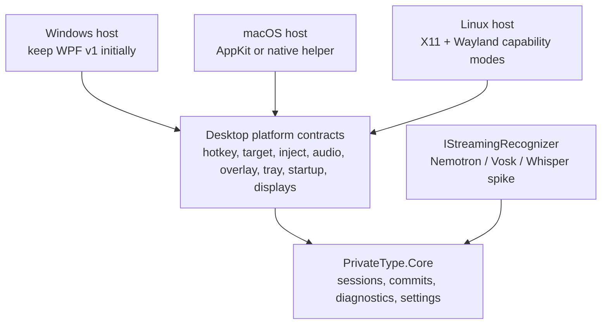

# .NET MAUI cross-platform feasibility for PrivateType

Research date: 2026-08-14. This is an engineering feasibility assessment, not
legal advice. No production code was changed as part of this research.

## Executive decision

**Do not migrate the current Windows application wholesale from WPF to .NET
MAUI as the route to Windows, macOS, and Linux parity.**

- **Fact:** .NET MAUI officially targets Android, iOS, macOS through Mac
  Catalyst, and Windows through WinUI 3. Linux is not an application target.
  On Linux, the MAUI workload can build Android apps; it does not produce a
  Linux desktop app. See Microsoft's [MAUI overview](https://learn.microsoft.com/en-us/dotnet/maui/what-is-maui),
  [supported-platform list](https://learn.microsoft.com/en-us/dotnet/maui/supported-platforms),
  and [installation target table](https://learn.microsoft.com/en-us/dotnet/maui/get-started/installation).
- **Fact:** Microsoft's MAUI window documentation says Mac Catalyst does not
  support programmatically repositioning a window with `X` and `Y`. The same
  documentation exposes only the main display through `DeviceDisplay`.
  PrivateType's non-activating, draggable, per-monitor overlay depends on
  both capabilities. See [MAUI Window](https://learn.microsoft.com/en-us/dotnet/maui/user-interface/controls/window)
  and [Device display information](https://learn.microsoft.com/en-us/dotnet/maui/platform-integration/device/display).
- **Fact:** The reviewed current MAUI API surface and official documentation do
  not expose cross-platform abstractions for the product's core desktop
  integrations: a persistent tray/menu-bar item, global hold-to-talk key-down
  and key-up handling, foreground-app identity, injection into another app, a
  non-activating always-on-top panel, continuous raw microphone PCM, or login
  startup. MAUI is designed to allow platform-specific code where necessary;
  these features would therefore remain separate native implementations.
- **Inference:** Rewriting the settings and diagnostics views in MAUI would
  share some UI, but would not remove most of the difficult platform work. It
  would also replace the already-working WPF host on Windows before macOS or
  Linux parity had been proved.

The practical route is to keep the Windows v1.0 host, preserve and expand the
portable `PrivateType.Core`, introduce explicit platform service contracts,
and build small native desktop hosts one platform at a time. A MAUI settings UI
could still be evaluated for Windows and Mac Catalyst, but it should not own the
overlay or be presented as the Linux strategy.

For a permissively licensed local recognizer, **Vosk is the best first
true-streaming compatibility spike** for the current English and Polish
shortcuts. Vosk's API is Apache-2.0, it exposes continuous streaming and C#
bindings, and its published small English and Polish models are individually
listed as Apache-2.0. It is not an automatic quality-equivalent replacement for
Nemotron; accuracy and macOS native packaging must be proved before adoption.

## Confidence labels

- **Fact** means the statement is directly supported by current project source
  or a linked primary source.
- **Inference** means it follows from those facts but has not been validated by
  a platform prototype.
- **Open** means a bounded prototype or owner decision is still required.

## Current application boundary

The current UI project is explicitly Windows-only: it targets
`net8.0-windows`, enables WPF and Windows Forms, and references NAudio in
[`PrivateType.App.csproj`](../src/PrivateType.App/PrivateType.App.csproj).
The following behavior is coupled to Windows APIs:

| Product capability | Current implementation evidence |
| --- | --- |
| Status icon and menu | `System.Windows.Forms.NotifyIcon` and `ContextMenuStrip` in [`DictationApplication.cs`](../src/PrivateType.App/DictationApplication.cs). |
| Global hold shortcut | A `WH_KEYBOARD_LL` hook observes and suppresses key-down/key-up; `RegisterHotKey` reserves configured combinations in [`HoldHotkeyHook.cs`](../src/PrivateType.App/HoldHotkeyHook.cs) and [`HotkeyRegistration.cs`](../src/PrivateType.App/HotkeyRegistration.cs). |
| Non-activating overlay | A topmost WPF window uses `WS_EX_NOACTIVATE`, HWND messages, and Windows Forms `Screen` topology in [`DictationBubble.xaml`](../src/PrivateType.App/DictationBubble.xaml) and [`DictationBubble.xaml.cs`](../src/PrivateType.App/DictationBubble.xaml.cs). |
| Per-monitor persistence | Device name plus normalized work-area coordinates are persisted by [`PortableSettings.cs`](../src/PrivateType.Core/PortableSettings.cs) and applied through `Screen.AllScreens`. |
| Raw microphone input | NAudio `WaveInEvent` produces 16 kHz, 16-bit, mono PCM every 100 ms in [`DefaultMicrophoneCapture.cs`](../src/PrivateType.App/DefaultMicrophoneCapture.cs). |
| Target safety | The target HWND is captured and later compared with `GetForegroundWindow`; process integrity is checked before insertion in [`Win32ForegroundTarget.cs`](../src/PrivateType.App/Win32ForegroundTarget.cs). |
| Text insertion | UTF-16 input events are emitted through Win32 `SendInput` in [`UnicodeTextInjector.cs`](../src/PrivateType.App/UnicodeTextInjector.cs). |
| Start at login | The current-user Windows `Run` registry key is managed by [`WindowsStartupRegistration.cs`](../src/PrivateType.App/WindowsStartupRegistration.cs). |
| ASR process | A Windows `nemo-speech.exe` child process hosts a loopback WebSocket service; model download is size/hash verified by [`EngineHost.cs`](../src/PrivateType.App/EngineHost.cs) and [`ModelProvisioner.cs`](../src/PrivateType.Core/ModelProvisioner.cs). |

The reusable boundary is already meaningful. `PrivateType.Core` targets plain
`net8.0`, and its contracts isolate `IAudioCapture`, `IStreamingRecognizer`,
`IForegroundTarget`, and `ITextInjector` in
[`DictationContracts.cs`](../src/PrivateType.Core/DictationContracts.cs).
Session coordination, commit de-duplication, transcript presentation, safe
target-change cancellation, spectrum analysis, and portable settings can be
shared. The desktop shell and platform services cannot.

## Feature-by-feature feasibility

| Capability | MAUI on Windows | MAUI on macOS (Mac Catalyst) | Linux desktop | Assessment |
| --- | --- | --- | --- | --- |
| Settings, setup, diagnostics UI | **Feasible.** Rewrite WPF XAML and templates in MAUI/WinUI. | **Feasible with visual differences.** Rewrite in MAUI/UIKit. | **Not available in MAUI.** A separate Linux toolkit is required. | Shared view models and design tokens are realistic; exact shared rendering is not. |
| Status/tray menu | **Platform code required.** MAUI has no documented cross-platform tray control; use Windows App SDK/Win32 or a helper. | **High risk in Catalyst.** The native API is AppKit `NSStatusItem`, while Apple says Catalyst apps may use only AppKit APIs explicitly marked available in Catalyst. A native AppKit helper or non-MAUI macOS host may be required. | **Separate implementation.** StatusNotifierItem is a D-Bus protocol; legacy XEmbed also exists. Desktop shells differ in whether and where they show status items. | Not a shared MAUI feature. |
| Global hold-to-talk hotkey | **Feasible with existing Win32 concepts.** The low-level hook/reservation code can be adapted around the WinUI window lifecycle. | **Feasible only with native permission work.** Quartz event taps provide key-down/up but require trusted accessibility/event-listen access. | **Feasible with limitations.** X11 can grab/listen directly; Wayland should use the GlobalShortcuts portal, which provides `Activated` and `Deactivated` signals. Backend availability and user approval must be detected. | One shared contract, three implementations. |
| Non-activating draggable overlay | **Feasible, significant rewrite.** Retrieve the WinUI HWND and reapply native extended styles and window positioning. | **Blocked for exact parity in ordinary MAUI APIs.** MAUI explicitly says Catalyst cannot programmatically reposition windows. AppKit's `NSPanel` has a non-activating style, but Catalyst cannot use unavailable AppKit APIs. A separately built AppKit panel/helper is the credible route. | **Environment-dependent.** X11 permits positioned/always-on-top windows. Wayland clients generally cannot choose global coordinates or stacking; compositor-specific protocols may provide overlays. GTK 4 removed global-coordinate, move, and keep-above APIs because not all backends support them. | This is the strongest reason not to use a pure MAUI shell. |
| Per-monitor saved position | **Feasible with Windows-specific display enumeration.** MAUI's shared API exposes only the main display, so native display topology remains necessary. | **Not feasible through shared MAUI window APIs.** Native screen enumeration is possible, but MAUI still cannot restore the window to arbitrary coordinates. | **X11 feasible; Wayland not generally equivalent.** Output identity exists, but placement is compositor-controlled. | Product semantics must differ on Wayland unless a supported overlay protocol is present. |
| Continuous microphone PCM | **Feasible.** Existing NAudio/WaveIn or WASAPI can remain behind `IAudioCapture`. | **Feasible with native AVFoundation.** `AVAudioEngine.inputNode` provides microphone input and a recording tap. Microphone permission and device selection UI are required. | **Feasible through PipeWire/PulseAudio/ALSA**, but a Linux audio implementation or portable native capture library is required. | MAUI's [MediaPicker](https://learn.microsoft.com/en-us/dotnet/maui/platform-integration/device-media/picker) is for photos/video, not raw streaming audio; there is no shared MAUI replacement for this service. |
| Foreground target identity | **Feasible with current Win32 approach.** | **Feasible with accessibility/native APIs, subject to user consent and target-app restrictions.** | **X11 feasible; Wayland restricted.** There is no portable client API for arbitrary foreground-window identity. | Target capture and eligibility rules must be platform contracts, not shared UI logic. |
| Insert text into another app | **Feasible with current `SendInput`, with current integrity/secure-field limitations.** | **Feasible with explicit Accessibility approval.** Core Graphics can create and post keyboard events; the app must check/request trusted accessibility status. | **X11 feasible through XTEST. Wayland is the blocker.** The RemoteDesktop portal can synthesize keycodes only inside a user-approved remote-desktop session; it is not a lightweight general text-insertion API. | Linux Wayland may require clipboard + user paste, an input-method integration, or a deliberately narrower supported-desktop policy. |
| Start at login | **Feasible through existing registry behavior or packaged startup APIs.** | **Feasible through `SMAppService` on macOS 13+, subject to user approval.** | **Generally feasible through an XDG autostart `.desktop` file**, with packaging/sandbox differences. | Straightforward platform service, not a MAUI abstraction. |
| Portable packaging | **Feasible.** MAUI supports packaged MSIX and unpackaged executable deployment; direct ZIP remains possible for an unpackaged build after verification. | **Different product shape.** MAUI publishes a universal `.app` or `.pkg`; downloaded unsigned builds are not normally launchable by double-click. Signing/notarization becomes part of public distribution. | **No MAUI output.** A separate AppImage/Flatpak/deb/rpm strategy and native dependencies are needed. | “One portable ZIP for every OS” is not realistic. |
| Model delivery and lifecycle | **Portable logic reusable.** Native engine artifact becomes RID-specific. | **Portable logic reusable.** Universal/x64/arm64 native artifacts and code signing must be handled. | **Portable logic reusable.** Package/sandbox paths, executable permissions, and per-architecture binaries differ. | Hash-pinned first-run delivery can remain shared; manifests and binaries become per engine/platform/architecture. |

### Primary platform sources for the matrix

- Microsoft describes MAUI's supported platforms and native escape hatches in
  [What is .NET MAUI?](https://learn.microsoft.com/en-us/dotnet/maui/what-is-maui).
  As of the research date, only MAUI 10 is supported; any new spike should use a
  currently supported version, not copy this app's .NET 8 target. See the
  [.NET MAUI support policy](https://dotnet.microsoft.com/en-us/platform/support/policy/maui).
- Microsoft's [Windows deployment overview](https://learn.microsoft.com/en-us/dotnet/maui/windows/deployment/overview)
  documents packaged MSIX and unpackaged executable outputs. Its
  [Mac Catalyst publish guidance](https://learn.microsoft.com/en-us/dotnet/maui/mac-catalyst/deployment/publish-unsigned)
  documents `.app`/`.pkg`, x64/arm64, and the inability to launch downloaded
  unsigned output normally.
- Apple documents the menu-bar primitive in
  [`NSStatusItem`](https://developer.apple.com/documentation/appkit/nsstatusitem),
  the non-activating AppKit panel style in
  [`NSWindow.StyleMask.nonactivatingPanel`](https://developer.apple.com/documentation/appkit/nswindow/stylemask-swift.struct/nonactivatingpanel),
  and Catalyst's restriction to AppKit APIs explicitly available to Catalyst in
  [Mac Catalyst](https://developer.apple.com/documentation/uikit/mac-catalyst).
- Apple documents key observation in
  [`CGEvent.tapCreate`](https://developer.apple.com/documentation/coregraphics/cgevent/tapcreate(tap:place:options:eventsofinterest:callback:userinfo:)),
  event creation/posting in [`CGEvent`](https://developer.apple.com/documentation/coregraphics/cgevent),
  trusted Accessibility checks in
  [`AXIsProcessTrustedWithOptions`](https://developer.apple.com/documentation/applicationservices/1459186-axisprocesstrustedwithoptions),
  raw microphone input in
  [`AVAudioEngine.inputNode`](https://developer.apple.com/documentation/avfaudio/avaudioengine/inputnode),
  and login registration in
  [`SMAppService`](https://developer.apple.com/documentation/servicemanagement/smappservice).
- Freedesktop specifies Linux
  [GlobalShortcuts](https://flatpak.github.io/xdg-desktop-portal/docs/doc-org.freedesktop.portal.GlobalShortcuts.html),
  the permission-heavy
  [RemoteDesktop input API](https://flatpak.github.io/xdg-desktop-portal/docs/doc-org.freedesktop.portal.RemoteDesktop.html),
  [portal backend selection](https://flatpak.github.io/xdg-desktop-portal/docs/portals.conf.html),
  [desktop autostart](https://specifications.freedesktop.org/autostart/latest/),
  and [StatusNotifierItem](https://specifications.freedesktop.org/status-notifier-item/latest/).
  X.Org documents synthetic input through
  [XTEST](https://www.x.org/releases/current/doc/libXtst/xtestlib.pdf).
- GTK 4's migration guide states that global/root coordinates, window movement,
  and keep-above APIs were removed because they are not portable across
  backends. See [Migrating from GTK 3.x to GTK 4](https://docs.gtk.org/gtk4/migrating-3to4.html).

## Linux must be treated as two product environments

“Linux support” is not one desktop contract.

### X11

- **Fact:** X11's XTEST extension can synthesize key press/release events.
- **Inference:** A traditional X11 implementation can closely reproduce the
  Windows behavior: global shortcut capture, active-window identity, positioned
  overlay, and injected text. It still needs careful Unicode/keymap handling and
  must detect applications that reject synthetic input.
- **Open:** Decide whether supporting an X11 session alone is acceptable for an
  initial Linux preview. Many modern distributions default to Wayland.

### Wayland

- **Fact:** The XDG GlobalShortcuts portal has activation and deactivation
  signals suitable for hold-to-talk semantics. Binding normally presents a
  compositor-provided user dialog, and a session may receive only a subset of
  requested shortcuts.
- **Fact:** Portal behavior is supplied by desktop-specific backends (GNOME,
  KDE, wlroots, and others); the installed backend can omit an interface.
- **Fact:** The standard RemoteDesktop portal can inject keys only after a
  remote-desktop session obtains keyboard access. This is materially more
  intrusive than PrivateType's current one-shot insertion.
- **Fact:** Mainstream cross-backend GTK removed global window positioning and
  keep-above APIs. This reflects the compositor-controlled Wayland model.
- **Inference:** Exact current parity cannot be promised across GNOME Wayland,
  KDE Wayland, wlroots compositors, and X11. A Linux edition needs a capability
  matrix and graceful modes, for example:
  1. full overlay + direct injection where supported;
  2. shortcut + transcript + clipboard with an explicit “press Paste” fallback;
  3. no release claim on a desktop whose required portal/backend is absent.

Any Linux acceptance suite must name at least the distribution, desktop shell,
shell version, display protocol (`X11` or `Wayland`), portal implementation, and
package format. “Tested on Linux” is too broad to be useful evidence.

## Permissively licensed ASR alternatives

The application license and the ASR runtime/model licenses are separate. MIT
licensing PrivateType does not remove the obligation to retain Apache or MIT
license notices for dependencies that are distributed with it. Not charging for
the application does not make license conditions disappear.

| Candidate | Runtime/API license | Model and language evidence | Streaming fit | Cross-platform integration assessment |
| --- | --- | --- | --- | --- |
| **Vosk** | Apache-2.0. The primary repository exposes C#, C/C++, Java, Python, and other bindings. | The official model table lists `vosk-model-small-en-us-0.15` (40 MB) and `vosk-model-small-pl-0.22` (50 MB) as Apache-2.0. | **True streaming.** The project describes continuous large-vocabulary transcription and zero-latency streaming results. | **Recommended first spike.** Small model footprint and direct PCM API match `IStreamingRecognizer`. Official C# installation documentation currently says NuGet should work on Windows and Linux and that macOS support may be added, even though native Vosk distributions exist for macOS. Therefore the exact C# macOS artifact path must be proved or built. Separate English/Polish models mean the current Auto mode needs redesign or an additional language detector. Accuracy may be materially below Nemotron. |
| **OpenAI Whisper + whisper.cpp** | OpenAI releases Whisper code and weights under MIT; whisper.cpp is MIT. | Whisper's official repository documents multilingual recognition and language identification, including a family of model sizes. | **Pseudo-streaming, not equivalent.** whisper.cpp calls its microphone stream example “naive”; it samples every 500 ms and repeatedly transcribes a rolling window. | Strong license clarity, multilingual behavior, and Windows/macOS/Linux native builds. It is a valuable quality/portability comparator, but adopting it changes provisional transcript, compute, latency, and finalization semantics. Do not call it a proven streaming replacement without a product spike. Avoid optional FFmpeg integration unless its separate license footprint is intentionally accepted. |
| **sherpa-onnx** | Apache-2.0 runtime with prebuilt C# libraries. | The C# API officially supports streaming/non-streaming and has a real-time microphone example. Model licenses are separate from the runtime. | **True streaming at API level.** | Technically attractive and directly embeddable in .NET. In the reviewed primary catalog, no specific permissively licensed streaming model was established that covers both Polish and English with current quality. Do not infer that the runtime's Apache license covers every downloadable model. Keep as a candidate if a model with explicit provenance/license is found. |

Primary ASR sources:

- [Vosk API repository](https://github.com/alphacep/vosk-api),
  [Vosk model table](https://alphacephei.com/vosk/models), and
  [Vosk installation/platform notes](https://alphacephei.com/vosk/install)
- [OpenAI Whisper repository and license statement](https://github.com/openai/whisper),
  [whisper.cpp license](https://github.com/ggml-org/whisper.cpp/blob/master/LICENSE),
  and [whisper.cpp stream example](https://github.com/ggml-org/whisper.cpp/tree/master/examples/stream)
- [sherpa-onnx repository](https://github.com/k2-fsa/sherpa-onnx) and
  [sherpa-onnx C# API](https://k2-fsa.github.io/sherpa/onnx/csharp-api/)

### ASR recommendation

Run a local, non-production engine bake-off before changing the public Windows
release:

1. Implement a Vosk `IStreamingRecognizer` adapter behind a development flag.
2. Pin and hash the small Apache-2.0 English and Polish models separately.
3. Compare current Nemotron, Vosk, and optionally whisper.cpp on the same
   opt-in local test corpus for Polish/English accuracy, time to first partial,
   release-to-final latency, CPU, and working set.
4. Keep all audio and transcripts local; report aggregate measurements only.
5. Audit the exact native binaries and include the relevant licenses/notices in
   any experimental package.

**Adopt Vosk only if the measured quality is acceptable.** Its cleaner
distribution terms solve a legal/packaging concern, not the recognition-quality
question. If Vosk quality is not acceptable, use Whisper as the next permissive
multilingual comparator or keep Nemotron while finishing the exact notice audit.

## Recommended architecture

Add these boundaries before any UI migration:

- `IGlobalHoldShortcut`
- `IStatusMenu`
- `IDictationOverlay`
- `IDisplayTopology`
- `IAutostartRegistration`
- `IEngineLifetime`

The existing `IAudioCapture`, `IStreamingRecognizer`, `IForegroundTarget`, and
`ITextInjector` remain. Settings should store logical intent while each host
stores platform-specific shortcut triggers, display identifiers, permissions,
and window placement.

### Why not replace WPF first

- **Fact:** The Windows implementation already has tested target-safety,
  lifecycle, hotkey, overlay, audio, and injection behavior.
- **Inference:** A MAUI/WinUI rewrite would spend substantial effort returning
  Windows to parity, while neither enabling Linux nor resolving Catalyst's
  overlay limitations.
- **Recommendation:** Publish the Windows v1.0 from WPF. Make the engine and
  platform seams explicit in parallel. Start macOS/Linux only after their
  native tracer bullets prove the hardest integrations.

## Required tracer bullets before approving a cross-platform program

### macOS proof on physical Mac hardware

The spike passes only if it demonstrates all of the following in one signed
development build:

1. menu-bar status item and menu without a persistent main window;
2. configurable key-down/key-up global shortcut with clear Accessibility
   onboarding and revocation handling;
3. a non-activating always-on-top panel that can be dragged and restored on two
   displays without stealing target focus;
4. continuous selected-microphone PCM capture;
5. capture of the original target, cancellation after a focus change, and
   Unicode insertion into at least a native editor and a browser;
6. start-at-login registration and removal;
7. `.app` packaging for Apple Silicon and Intel, with a signing/notarization
   plan.

If a Mac Catalyst application cannot satisfy items 1–3, stop the MAUI spike and
prototype an AppKit host/helper rather than layering unsupported window hacks.

### Linux proof on named environments

Test at minimum:

- current Ubuntu GNOME Wayland;
- current Fedora GNOME Wayland;
- current KDE Plasma Wayland;
- one X11 session as the full-parity reference.

For each, record availability of GlobalShortcuts activation/deactivation,
status item visibility, overlay placement, microphone/device selection,
foreground-target protection, text insertion, autostart, and package sandbox
behavior. A missing capability must result in an explicit degraded mode, not a
silent failure.

## AI-agent scope estimate

These are engineering-token estimates, not human calendar estimates. One
“review cycle” means implementation plus relevant tests, fresh platform review,
and repairs. Hardware setup, certificate/account waiting, and subjective ASR
quality collection are excluded.

| Slice | Estimated agent tokens | Expected proof |
| --- | ---: | --- |
| Extract/complete platform contracts while preserving Windows behavior | 25k–45k | Existing Windows tests pass; no product behavior changes. |
| Vosk English/Polish engine adapter and local benchmark harness | 35k–65k | Streaming/finalization tests, pinned model manifests, aggregate benchmark output. |
| MAUI/WinUI Windows parity rewrite | 90k–150k | Full current UI and hardware smoke suite on the final Windows package. |
| Mac Catalyst feasibility tracer bullet | 35k–60k | Written pass/fail for menu, shortcut, overlay, injection, audio, startup. |
| Production macOS host after a successful native proof | 120k–220k | Signed universal app, two-monitor and permissions acceptance suite. |
| Linux X11 host | 80k–140k | Full behavior on named X11 environment and package. |
| Linux Wayland capability implementation | 140k–260k | GNOME/KDE portal matrix, degraded modes, package tests. |
| Cross-platform packaging, updater/model manifests, notices, release automation | 50k–100k | Reproducible signed/notarized artifacts with hashes and license bundles. |

Two realistic totals:

- **Windows v1 plus engine abstraction and Vosk evidence:** approximately
  **60k–110k agent tokens**. This does not require a UI migration.
- **Windows + production macOS + limited named Linux environments:**
  approximately **450k–750k agent tokens**, assuming the macOS tracer bullet
  succeeds and Linux accepts documented degraded modes.

A promise of exact Windows behavior on every Wayland compositor has no honest
fixed estimate because required capabilities are not uniformly exposed.

## Final recommendation

1. Publish the current WPF application as Windows-only v1.0 after its existing
   release gates are complete.
2. Do not make MAUI migration a prerequisite for that release.
3. Extract the portable core and platform contracts without rewriting the
   Windows UI.
4. Run the Vosk English/Polish streaming bake-off; select it only on measured
   product quality and an exact artifact/license audit.
5. Run the macOS native tracer bullet. Use AppKit for the shell if Catalyst
   cannot reproduce the overlay and menu-bar behavior.
6. Treat Linux as a separate platform program with explicit X11/Wayland and
   desktop-environment support levels. MAUI is not the Linux desktop host.

The desired cross-platform product is feasible as **shared domain logic plus
platform-native desktop integration**. It is not feasible as a straightforward
WPF-to-MAUI conversion with identical behavior on Windows, macOS, and Linux.
