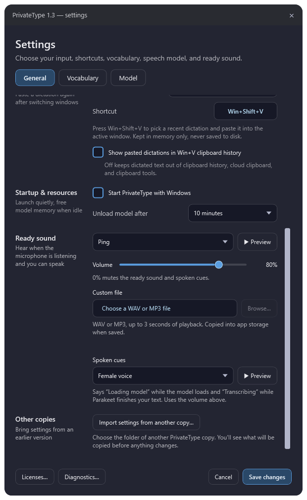
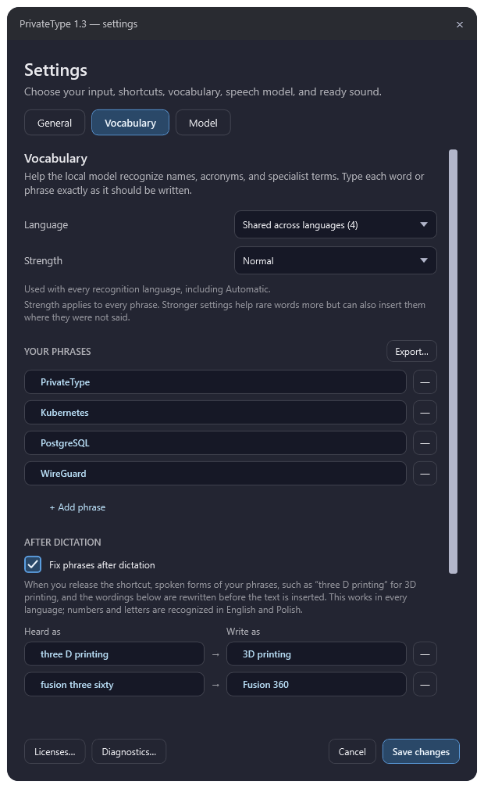
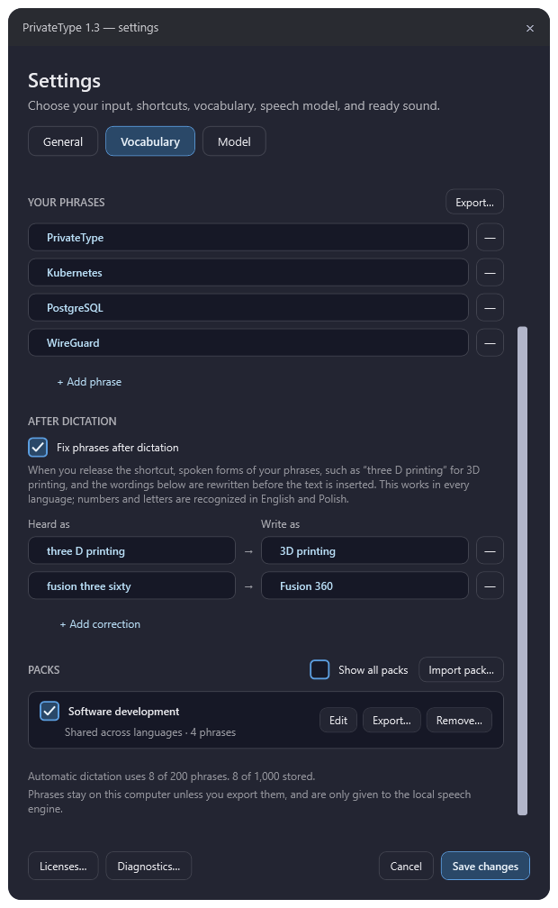
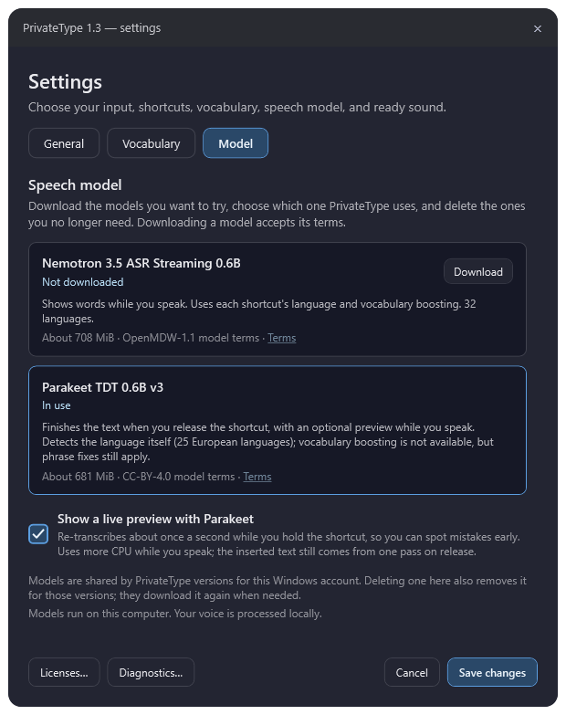

# Settings guide

Every PrivateType setting: what it does, its default, and when to change it.

Open **Settings** from the tray icon or the bubble menu. Settings has three
tabs: [General](#general), [Vocabulary](#vocabulary), and [Model](#model).
Nothing changes until you choose **Save changes**; **Cancel** discards
everything you changed since opening the window.

**Quick start:** the defaults suit most people. Usually you only need to:

1. pick your **Microphone**,
2. check the **Shortcuts** match the languages you speak,
3. add words the model keeps getting wrong to **Vocabulary**.

## General

### Microphone

The recording device used for every shortcut.

| Option | Meaning |
| --- | --- |
| **System default microphone** (default) | Uses the device chosen in Windows sound settings at the moment you start dictating, so it follows when you switch it. |
| A named device | Always uses that device, whatever Windows' default is. |

**Recommended:** a headset or a microphone close to your mouth. Pick a named
device if Windows sometimes switches the default to a webcam or monitor
microphone.

### Shortcuts

Each row is one shortcut: a **language** and a **key combination**.

| Default shortcut | Language |
| --- | --- |
| `Ctrl+Shift+R` | Polish (Poland) |
| `Ctrl+Shift+E` | English (United States) |

- **Language** tells the model which language to expect. Choose one of 32
  languages and regions, or **Automatic** to let the model decide. The
  language also chooses which [vocabulary](#vocabulary) is used.
- **Key**: click the shortcut box, then press `Ctrl+Shift` plus a letter,
  number, or function key. Each shortcut needs a different key.
- **+ Add shortcut** adds another row. **—** removes one. At least one shortcut
  must stay.

**Recommended:** one shortcut per language you dictate in. Use **Automatic**
only if you switch languages often; it uses shared vocabulary only, never a
language's own phrases.

### Shortcut behavior

| Option | How it works |
| --- | --- |
| **Hold to talk** (default) | Hold the shortcut while you speak; release to insert the text. |
| **Press to start and stop** | Press once to start listening, press again to insert. If the model is still loading, listening starts by itself when it is ready. |

**Recommended:** Hold to talk for short messages. Press to start and stop for
long dictation, where holding keys is tiring.

### Insert text by

| Option | How it works |
| --- | --- |
| **Pasting** (default) | Inserts the whole text in one step, so pressing Enter straight away can't send half of it. Your previous clipboard is put back afterwards, unless you copied something new in the meantime. |
| **Typing characters** | Types the text character by character and never touches the clipboard. |

**Recommended:** Pasting. Switch to Typing characters only for apps where
`Ctrl+V` doesn't paste, such as Vim or PuTTY.

### Recent dictations

If you switch windows before the text arrives, the text isn't inserted. Recent
dictations let you paste it again: press **Win+Shift+V** or choose **Recent
dictations…** in the bubble menu. Up to 50 dictations are listed, newest first.
A dictation that wasn't inserted is marked **Not inserted**.

**Keep dictations**: how long they stay in the list.

| Option | Meaning |
| --- | --- |
| **Until PrivateType exits** (default) | Cleared when you close PrivateType or sign out. |
| **For 1 hour** / **For 15 minutes** | Each dictation is removed after that time. |
| **Don't keep** | No list. The shortcut is left to Windows and other apps. |

**Shortcut** opens the list (default `Win+Shift+V`). Click the box, then press
the new combination. It needs **Win**, or two of **Ctrl**, **Alt**, and
**Shift**, plus a letter, number, or function key. PrivateType refuses:

- a single modifier such as `Ctrl+V`, which would block typing or pasting,
- `Ctrl+Alt` combinations, which are AltGr on many keyboards and type letters
  such as ą,
- the exact combination of a dictation shortcut.

Some Win combinations, such as `Win+L`, are kept by Windows and can't be used.

Dictations are kept in memory only and are never written to disk.

**Show pasted dictations in Win+V clipboard history** (off by default) lets
pasted text appear in Windows clipboard history. Windows keeps those entries
until you clear them or restart, and other clipboard tools can read them.
Cloud clipboard skips dictated text either way. This setting is available only
with **Pasting**.

**Recommended:** keep the default. Choose a shorter time on a shared computer.

### Startup & resources

**Start PrivateType with Windows** (off by default) starts PrivateType when you
sign in, using an entry for your Windows account only. If you later start a
different version, PrivateType asks whether that version should start with
Windows instead.

**Unload model after** frees the model's memory (about 0.8–1.1 GiB) after
5, 10 (default), 15, or 30 minutes without dictation. The next dictation loads
it again, which takes a moment. Keep holding the shortcut while **Loading local
model…** is shown.

**Recommended:** turn on startup if you dictate daily. Choose 30 minutes if you
dictate often and have 8 GB of RAM or more. Choose 5 minutes if memory is tight.

### Ready sound

The ready sound plays when the microphone starts listening, so you know you
can speak.

- **Sound**: **Ping** (default), **Chime**, **Bell**, or **Custom file**.
  **▶ Preview** plays your choice right away.
- **Volume**: 0–100%, default 80%. 0% mutes the ready sound and the spoken cues.
- **Custom file**: with **Custom file** selected, choose **Browse…** to pick a
  WAV or MP3. It is copied into PrivateType's storage when you save, and only
  the first 3 seconds play. If the copy later can't be read, Ping plays instead.
- **Spoken cues**: **Female voice** (default), **Male voice**, or **Off**. A
  voice says "Loading model" while the model loads and "Transcribing" while
  long text is being finished. It uses the same volume.

When you release the shortcut, a soft falling blip means the microphone is
off. It is replaced by "Transcribing" when the text will take a moment.

**Recommended:** keep a sound on. Without it, it's easy to start speaking
before the microphone is listening and lose your first word.

## Vocabulary

Vocabulary helps the model write names, acronyms, and technical terms
correctly. Add a phrase only when the model keeps getting it wrong.

### Language

Chooses which phrase list you are editing. The number in brackets is how many
phrases that list holds.

- **Shared across languages**: used with every shortcut, including
  Automatic.
- **A language**, such as Polish: used only with that language's shortcuts,
  together with the shared phrases.

### Strength

How strongly the model favours your phrases. It applies to every phrase.

| Option | When to use |
| --- | --- |
| **Low** | The model starts writing your phrases where you didn't say them. |
| **Normal** (default) | Suits most people. |
| **Strong** | A stubborn word still isn't recognized. It is more likely to insert phrases you didn't say. |

On PrivateType's tests, vocabulary raised correctly spelled technical terms
from about 1 in 5 to about half.

**Recommended:** Normal, with **Fix phrases after dictation** on.

### Your phrases

Type each word or phrase exactly as it should be written. **+ Add phrase** adds
a row, **—** removes one, and **Export…** saves this list as a pack file you
can share.

The quickest way to add phrases is **Teach from last dictation…** in the
bubble menu. Click the words it got wrong, type the correct spelling, and
choose **Add fix**.

### After dictation

**Fix phrases after dictation** (on by default) corrects the finished text
before it is inserted. The model tends to write what it hears, such as "three
D printing" or "fusion three sixty". This step turns that into "3D printing"
and "Fusion 360", whether the numbers and letters are spoken in English or
Polish.

The **Heard as → Write as** list adds your own replacements. Teach adds them
for you. You can also add one with **+ Add correction**, or edit and remove
them here. Only whole words are replaced, and never across a full stop or
comma.

**Recommended:** keep it on. It also works with Parakeet, which has no
vocabulary boosting.

### Packs

Packs are named phrase lists you can share, for example a list of product
names for your team.

- **Import pack…** reads a `.privatetype-vocabulary.json` file, shows every
  phrase, and asks which language it is for.
- The checkbox next to a pack turns it on or off.
- **Edit**, **Export…**, and **Remove…** manage one pack. Export writes only the
  phrases you leave ticked.
- **Show all packs** lists packs for every language, not only the language
  selected above.

PrivateType never downloads packs itself. Some examples are in
[vocabulary-packs](../vocabulary-packs/).

### Limits

- Each dictation uses at most **200 phrases**: your shared and language
  phrases plus the packs that are on. Saving is refused if a language would go
  over.
- Up to **1,000 phrases** and **50 packs** can be stored.
- A phrase can be up to 120 characters.

The line under Packs shows how many phrases the selected language uses.

## Model

PrivateType can use either of two local NVIDIA speech models.

| | Parakeet TDT 0.6B v3 (recommended) | Nemotron 3.5 ASR Streaming 0.6B |
| --- | --- | --- |
| While you speak | Text appears on release, with an optional preview | Words appear live |
| Language | Detected automatically (25 European languages) | From each shortcut (32 languages) |
| Vocabulary boosting | No; **Fix phrases after dictation** still applies | Yes |
| Download | About 681 MiB | About 708 MiB |
| Memory while loaded | About 790 MiB, up to 1.1 GiB while finishing a long dictation | About 935 MiB |

New installs start with Parakeet. A new release folder reuses a model another
PrivateType version already downloaded, so updating never asks you to download
again. If you have both models, it starts with Nemotron, as earlier versions
did; switch in **Settings → Model**.

- **Download** fetches a model. Downloading accepts its terms (**Terms** link).
- **Use** selects a downloaded model. It takes effect when you save.
- **Delete…** removes a model you no longer need. The model in use can't be
  deleted; switch to the other one first.

**Show a live preview with Parakeet** (on by default) re-transcribes what you've
said about once a second while you hold the shortcut, so you can spot mistakes
early. It uses more CPU while you speak. The inserted text still comes from one
pass on release. Turn it off on a slow computer.

**Recommended:** Parakeet, which finishes the whole sentence at once on release. Choose Nemotron for live words while you speak, vocabulary boosting, or Asian languages such as Japanese, Korean, and Chinese.

**Where models are stored:** by default, models are shared by all PrivateType
versions on your Windows account, in `%LOCALAPPDATA%\PrivateType\models`.
Deleting one also removes it for those versions; they download it again when
needed. For a fully portable copy, create an empty `app\models` folder in the
PrivateType folder before its first start.

## Keyboard shortcuts

These work anywhere in Windows:

| Shortcut | What it does | Change it |
| --- | --- | --- |
| `Ctrl+Shift+R` | Dictate in Polish | **General → Shortcuts** |
| `Ctrl+Shift+E` | Dictate in English | **General → Shortcuts** |
| `Win+Shift+V` | Open **Recent dictations** to paste one again, including one marked **Not inserted** | **General → Recent dictations → Shortcut**. Off when **Keep dictations** is **Don't keep** |

In **Recent dictations**:

| Key | What it does |
| --- | --- |
| `↑` / `↓` | Choose a dictation |
| `Enter` | Paste it into the window you were in |
| `Delete` | Remove it from the list |
| `Esc` | Close the list |

In **Teach from last dictation**:

| Key | What it does |
| --- | --- |
| `Enter` (in the spelling box) | Add the fix |
| `Esc` | Clear the selected words; press again to close |

## Other buttons

- **Licenses…** shows the open-source notices.
- **Diagnostics…** shows recent warnings and errors since PrivateType started.
  They never include audio or dictated text. Review them before sharing.

## Settings that aren't in this window

- **Bubble position**: drag the bubble by its icon. PrivateType remembers
  where you left it, relative to the screen.
- **Where settings are saved**: `app\data\settings.json` in the PrivateType
  folder. It holds the settings on this page and your vocabulary, but never
  audio or dictated text. If part of the file is damaged, only that part is
  reset to its default when PrivateType starts.
